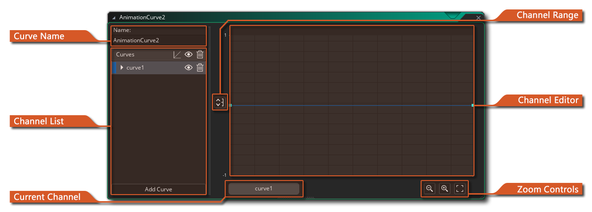
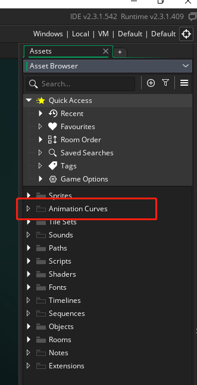
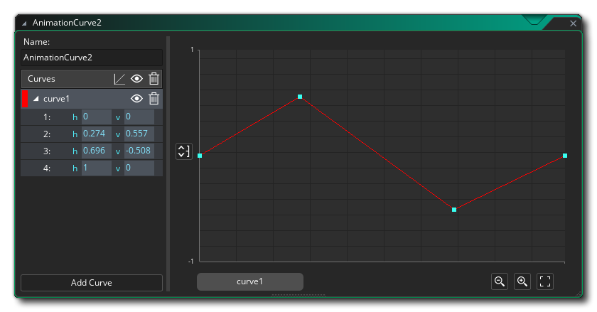
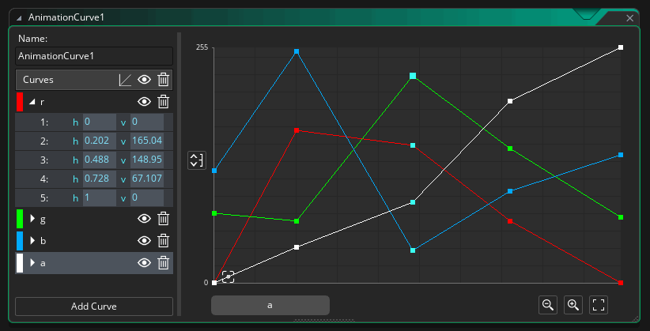
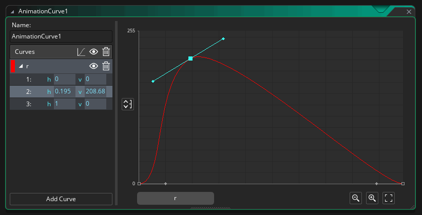
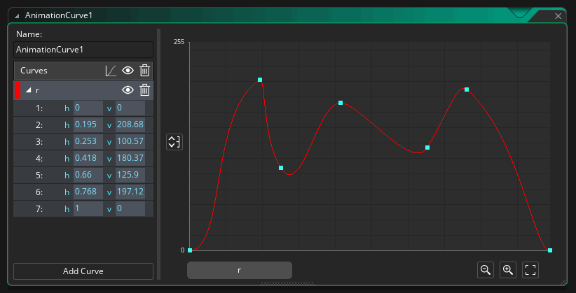
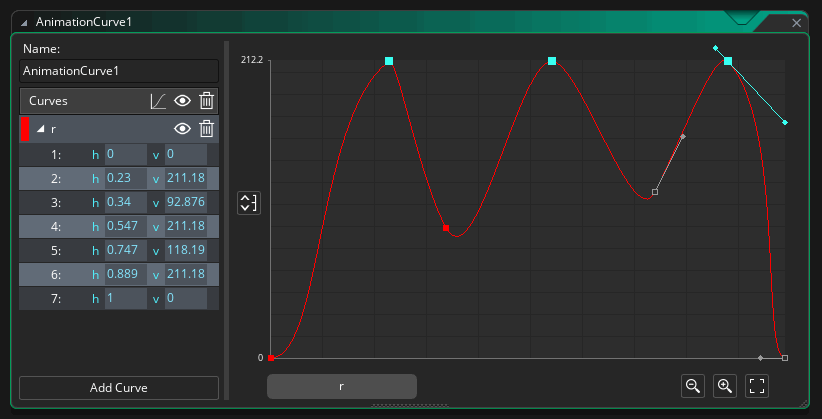

# The Animation Curve Editor 椭圆曲线编辑器

译者加：

动画曲线是一种资产，包含一条或多条代表值随时间变化的曲线，可以使用线性插值，平滑插值或贝塞尔曲线插值在曲线的不同点之间移动。您在垂直轴上设置的值可以介于任意两个值之间（默认情况下介于-1和1之间），沿水平轴的持续时间始终以0到1的形式进行归一化，从而可以轻松地在您的乘数中使用不同的时间范围来定位不同的时间范围游戏代码或将其拉伸以适合“序列编辑器”中的曲目。

动画曲线由“通道”组成，每个通道可以有自己的曲线设置，例如，您可以-用两个通道描述x / y位置的空间位置，或用4个通道代表一个通道的颜色梯度。颜色格式。动画曲线资产可以在使用序列时使用，也可以使用代码进行访问，从而使它们成为创建游戏时的强大工具。

首次创建动画曲线素材时，编辑器窗口将打开，并向您显示以下部分：

## Curve Name

在这里，您可以为动画曲线指定一个唯一的名称（仅字母数字字符和“ _”下划线符号）。通过代码或按顺序访问曲线时，将使用该名称来引用曲线及其所有通道。

## Channel List

您可以在通道列表中添加和命名将构成动画曲线资产的不同通道。 默认情况下，首次创建动画曲线时，会为您添加一个通道，您可以通过单击底部的“添加通道”按钮来添加其他通道。每个通道必须具有唯一的名称（仅使用字母数字字符和下划线符号_），并且您还可以通过双击左侧色样上的来设置通道的颜色，这将打开颜色选择器，让您选择新的颜色。要重命名频道，您可以双击并重命名，还可以使用鼠标右键打开菜单，您可以在其中选择重命名，更改颜色或删除频道。

通过单击名称旁边的箭头以显示通道曲线上的每个点，可以扩展通道，可以通过单击当前值并输入新值来手动编辑这些点：

您可以通过点击“眼睛”图标切换频道可见性，或者通过点击“ bin”图标删除频道。您还可以通过单击通道类型图标并选择以下选项之一来更改通道从一点到另一点的流动方式：

- 线性：这将在通道上的点之间创建线性级数
- 平滑：这将使用catmull-rom插值法在通道上的点之间创建平滑的渐变
- Bezier：这将使用Bézier曲线数学在通道上的点之间创建平滑的渐变，您可以在该点上通过操纵点上的“手柄”来控制曲线的外观。

**请注意，更改通道的曲线类型会将这种类型应用于所有通道。**

## Channel Range

通道范围按钮用于设置通道编辑器的可视垂直范围。默认情况下，它将设置为-1到1，但是单击此按钮将打开以下窗口：

更改这些值将更改“通道编辑器”部分中数据的表示方式，使您沿通道曲线可以具有比-1到1高或低的值。请注意，这纯粹是视觉上的，并不用于限制通道的值。

## Channel Editor

通道编辑器显示了动画曲线中使用的不同通道的直观表示。默认情况下，所有通道都将显示在此处，但是您只能编辑当前从“通道列表”中选择的通道，该列表将在编辑器中突出显示。您可以通过在通道曲线上单击并在编辑器中将其拖动来更改沿曲线的任何点的位置，但是请注意，第一个和最后一个点只能沿垂直轴更改，并且其水平值始终为0和1。

您可以通过以下方式将点直接添加到通道曲线中：将鼠标移至主通道线附近，然后单击``当光标变为``添加点''工具时，然后可以通过单击并拖动或更改其值来编辑这些点在频道列表的展开的频道选项中：

 您可以通过单击并在编辑器中拖动以选择所有要编辑的点来一次编辑多个点，或者使用/ +将点单独添加到选择中。释放鼠标按钮，然后再次单击所选内容中的任何点并拖动将它们一起移动：

## Zoom Controls

缩放控件允许您在通道编辑器中扩展或收缩通道曲线的垂直比例。

