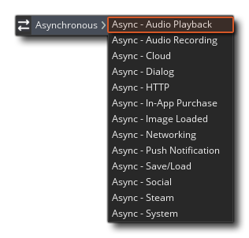

# Audio Playback



此事件只能由音频队列播放功能触发，并将返回存储在变量async_load中的DS Map，其中包含与触发事件的音频队列相关的不同键/值对。当您选择要播放的音频队列并且该音频队列中的缓冲区已播放完毕时，该事件由回调触发。

DS映射中将提供以下键：

- "**queue_id**" - 函数audio_create_play_queue（）返回的已完成播放队列的队列索引。
- "**buffer_id**" -  不再从中播放的缓冲区的缓冲区ID。
- "**queue_shutdown**" -  由于已调用audio_free_play_queue（），因此在正常播放期间将其设置为0，在接收到事件时将其设置为1。设置为1时，您不想排队其他任何数据。

由于可以从多个缓冲区创建音频队列，因此在到达缓冲音频的每个部分的末尾时，可以为一个队列多次触发此事件，因此需要使用“ buffer_id”键。

> 注意：变量async_load仅在异步事件中有效，因为指向的DS映射是在事件开始时创建的，然后在末尾再次删除，此变量重置为值-1。但是，必须使用适当的函数清除从事件创建的所有其他数据结构。

在下面给出的使用示例中，我们将创建一个音频队列，并添加10种缓冲的音频声音，然后播放该队列：

```javascript
audio_queue = audio_create_play_queue(buffer_s16, 11052, audio_mono);
for (var i = 0; i < 10; i++;)
   {
   audio_queue_sound(audio_queue, audio_buffer[i], 0, buffer_get_size(audio_buffer[i]));
   }
audio_play_sound(audio_queue, 0, true);
```

现在，检测到录制的每个游戏步骤都会触发一个异步音频录制事件，您可以在其中处理录制的输入，如下所示：

```javascript
var queue = async_load[? "queue_id"];
var num = 0;
if queue = audio_queue
   {
   for (var i = 0; i < 10; i++;)
      {
      if async_load[? "buffer_id"] == audio_buffer[i]
         {
 buffer_seek(audio_buffer[i], buffer_seek_start, 0);
         num = i;
         }
      }
   if num == 9
      {
      audio_stop_sound(audio_queue);
      audio_free_play_queue(audio_queue);
      }
 }
```

在这里，我们检查队列ID，如果它是我们想要的队列ID，则我们检查缓冲区ID，以查看哪个缓冲区已完成播放。然后，我们还将本地var设置为该索引值以供以后检查，并将缓冲区重新设置为该声音的开始。一旦我们的局部变量达到9，表明队列已完成，我们将停止播放声音并释放队列。