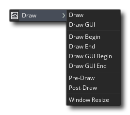
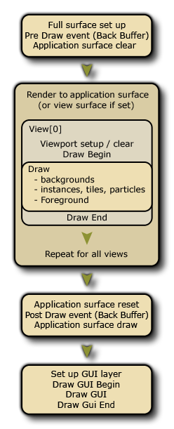
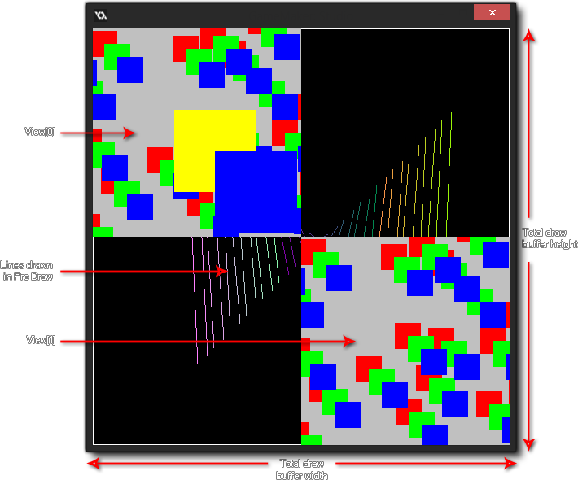

# The Draw Events

绘画事件类别是具有所有事件的类，该事件控制着您在运行游戏时在屏幕上看到的内容。它分为多个单独的事件，以更好地满足您游戏的不同绘画要求，下图说明了每个事件的执行顺序：

 普通的Draw事件分为三个子类型：Draw Begin，标准Draw和Draw End事件。通常，您只需要使用标准的Draw事件，并且您应该知道房间中的所有实例都会在游戏的每个步骤触发此事件，因此只要实例具有可见的外观，便始终会调用此事件。标志设置为true。重要的是要理解，即使您没有在对象属性中为该子事件定义任何内容（即，没有代码或动作），如果为对象分配了精灵，则它将仍然具有将触发的绘制事件。这是因为GameMaker Studio 2具有两种在Draw事件中绘制内容的方式：

- 默认绘制，即当您在对象属性中定义精灵并在常规Draw事件中不放置任何动作或代码时，在这种情况下，GameMaker Studio 2将自动绘制分配的精灵。请注意，只要绘制事件为空，您在其他事件中执行的任何更改图像缩放比例，索引，混合等的变换都将反映出来。
- 自定义绘图，这是您在绘图事件中放置代码或动作的时间。这是在告诉GameMaker Studio 2'我想控制您为该对象实例绘制的内容'，并且它完全覆盖默认绘制。这意味着，例如，您可以为一个对象指定一个sprite，然后设置draw事件以绘制文本，并且该文本将在屏幕上绘制，但是由于您没有告知GameMaker Studio 2，因此不会绘制该Sprite。将其与文本一起绘制。

其余的绘制事件将在下面列出的部分中进行说明：

## Draw Begin And Draw End

除了主要的Draw事件之外，您还具有Draw Begin和Draw End事件。它们的行为与标准Draw事件完全相同（即：它们将在游戏的每个步骤以及所有视口中绘制您放置在它们中的任何内容），但是如果未将它们明确添加到屏幕上，则它们不会“默认绘制”任何内容。对象，它们将始终在标准Draw事件之前/之后运行。因此，在游戏运行时，您将始终对所有实例具有Draw Begin事件，然后对所有实例具有Draw事件，最后对所有实例具有Draw End事件。

这样，您可以在一个实例的“绘制开始”步骤中绘制事物或设置绘制属性，并确保所有具有标准Draw事件或Draw End事件的实例都将使用这些属性或绘制第一个实例所绘制的内容。 基本上，这是一种确定的方法，可以确保在某些时间绘制某些内容，就像“开始步骤”和“结束步骤”事件一样。

在GameMaker Studio 2中进行绘制时，需要注意一些事项，无论是正在绘制的精灵，着色器还是3D缓冲区：

- 绘制事件是一个非常密集的事件，因为它是占用大量时间和资源的事件之一……为此，在绘制事件中除了绘制之外，不做任何事情都是一个好主意。因此，请为Step事件或Alarms或其他适合的事件保存大型代码或复杂的操作，但最好将draw事件保留在绘图中，因为这样做才是最好的。
- 如果您的对象的visible参数设置为off（以便不绘制该对象的实例），则将跳过所有绘制事件（“调整大小”事件除外）。这意味着使实例不可见将阻止运行任何这些事件中的所有代码，因此，如果基本代码不可见，请不要将必需的代码放入draw事件中。
- 绘制的内容与您选择的碰撞引擎（传统的或物理的）无关，这是由对象属性和已赋予对象的精灵（或蒙版）定义的。

## Draw GUI

Draw GUI事件类型属于Draw Event类别，是专门为不受视图摄像机比例或旋转影响的图形GUI元素设计的。这意味着您可以让实例为HUD或用户界面绘制所有元素，而不必将元素的所有位置都基于房间内的实例位置或当前摄像机视图的位置。

在这种情况下进行绘制时，重要的是要了解即使在摄像机视图处于活动状态时绘制坐标也不会改变，并且（0,0）始终是应用程序表面或显示屏的左上角（请参见此部分的底部），并且应用程序表面的默认宽度和高度为1：1。深度顺序仍然保持在不同层上的不同实例之间（因此，较高层的实例将被绘制在较低层的一个实例之下）以及事件本身内，因为Draw GUI Begin事件将首先为所有实例绘制，然后标准Draw GUI将为所有实例绘制图形，最后触发Draw Gui End事件。

这样，您可以在一个实例中的Draw GUI Begin中绘制事物或设置draw属性，并确保具有标准Draw GUI或Draw GUI End事件的所有实例都将使用这些属性或覆盖第一个实例绘制的内容。基本上，这是一种确保在特定时间绘制某些东西的肯定方法，就像``开始步骤''和``结束步骤''事件一样。

这些事件也可以与正常的Draw事件一起使用（通常会受到摄影机视图位置，比例和旋转的影响）。如果您没有Draw事件，但确实有Draw GUI事件，则GameMaker Studio 2仍将照常默认为该实例绘制精灵（如果有）。

与其他绘制事件有关，Draw GUI事件将始终覆盖正常绘制事件中绘制的所有内容。因此，如果您在较低层上有一个带有Draw GUI事件的实例，则它将通过常规绘图事件在较高层上的实例上进行绘制。如果两个实例都具有Draw GUI事件，则将遵守图层顺序。

> 注意：默认情况下，此事件将使用应用程序表面尺寸（通常是房间或视口的尺寸）绘制1：1。这意味着，当您在“游戏选项”中启用了“宽高比校正”时，将不会在“字母框”游戏的黑条上绘制GUI。可以使用display_set_gui_maximise（）函数关闭此行为，并且还可以将GUI事件锁定为特定大小，然后使用display_set_gui_size（）函数将其缩放为适合显示或应用程序表面尺寸的大小。

## Pre And Post Draw

Draw Pre和Post Draw事件属于Draw Event类别。但是，与其他Draw事件不同，它们直接绘制到显示缓冲区，这将是当前可见的所有视口的合并屏幕空间的大小，或者如果仅使用一个视口或根本不使用任何视口，则为窗口大小。下图说明了这一点：

 因此，如果您使用的是Pre或Post绘制事件，则将绘制到全屏渲染目标（显示缓冲区），该目标的大小将与所有视口都适合的窗口大小相同。如果没有活动的视口，则将其设置为窗口本身的大小。

Pre Draw事件在任何其他draw事件之前触发，您可以在其中设置值，设置draw属性甚至绘制东西，而不必担心视口或GUI层的大小（GUI层的大小可能与屏幕缓冲区，但可能不是，因为您可以在代码中设置GUI分辨率。

值得注意的是，此事件发生在清除常规图形的显示缓冲区之前，这意味着如果您不关闭房间编辑器中的视图清除功能，则在Pre Draw事件中绘制的任何内容都不会被看到，这是第一个视口绘制会清除它。如果您想自己查看视口，或者根本不使用视口，那么还应该在``房间编辑器''中将背景色设置为alpha为0。

> 注意：如果关闭这些选项，则在测试游戏时，您可能会注意到屏幕上绘制了不必要的假象（例如实例中的“拖尾”）。这是因为您直接在显示缓冲区的前一帧上绘制而未清除它。但是您可以使用draw_clear_alpha（）自己执行此操作。

在所有标准绘图事件之后但在Draw GUI事件之前触发Post Draw事件。与Pre Draw事件类似，它基于显示缓冲区的大小，并置于Draw GUI事件之前，使您能够简单，轻松地在不干扰任何HUD的情况下以全屏方式执行后处理效果和其他操作。 /游戏中可能包含的GUI元素。

## Window Resize

此事件类型属于“绘制事件”类别，尽管它实际上并未绘制任何内容，但它确实对显示缓冲区的变化做出了反应-特别是，它设计用于在游戏窗口时对UWP显示缓冲区大小的变化做出反应。被“捕捉”。

在UWP目标平台上，重要的是要从游戏窗口的“捕捉”中捕获显示缓冲区的任何大小调整（例如，当用户将窗口拖动到显示器的侧面时）。此事件将执行此操作，并在每次更改窗口时触发该事件，使您可以在此处添加自定义代码，该代码将调整视图的大小或根据需要重新定位HUD元素。提供此功能是避免步骤事件代码始终检查这些事件的便捷方法。

> 注意：您不能在此事件中绘画！它是通过调整窗口大小来触发的，并且仅用于捕获此更改...应进行的任何绘制仍必须处于其他绘制事件之一中。