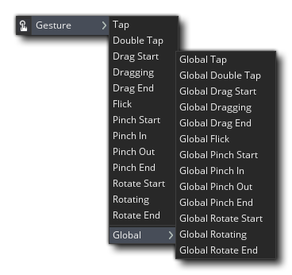
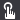
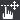
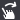
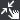
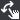

# The Gesture Events 手势事件



每当GameMaker Studio 2检测到鼠标的“手势”或触摸屏事件时，都会触发“手势事件”类别中的事件（尽管这些手势事件是专门为移动设备设计的，但它们也可以用于其他目标上以检测鼠标，尽管在这种情况下他们不会检测到多次触摸）。手势系统的目标是尝试在比直接鼠标\\触摸读取功能更高的级别上识别输入，并旨在简化基于触摸的设备上常用输入的实现。

>注意：由于缺少对在该平台上使用这些事件的多点触摸的支持，因此不会在HTML5平台上触发这些事件。如果要在该目标上寻找手势，则应该使用设备功能。

您可以选择检测实例手势还是全局手势，其中仅当初始触摸/单击位于房间中的实例上时才会触发实例手势事件。请注意，实例必须具有有效的碰撞遮罩（有关更多详细信息，请参见“ Sprite编辑器-碰撞遮罩”和“对象编辑器-碰撞遮罩”部分）以触发此事件。 但是，全局事件将通过在游戏室内的任何地方以及所有具有该事件的实例上触摸/单击来触发。

识别手势后，它将触发一个或多个可用事件，并且触发的事件将取决于已检测到的手势类型。但是在每种情况下，都会为您生成一个DS Map，并将其存储在内置变量event_data中。可用的密钥将取决于创建该事件的类型，并在下面的每个小节中显示。

> 注意：变量event_data仅在这些事件中有效，因为它指向的DS映射在事件开始时自动创建，然后在末尾再次销毁，并且此变量的值全部重置为-1。其他时间。

值得注意的是，如果您在触摸的位置下有多个实例，并且它们都具有手势事件，那么它们都会触发，而不仅仅是“最顶层”的实例。 还要注意，当使用多个摄像机视图并拖动一个实例时，返回的值将基于您收到初始触摸/单击时所在的视图-对于该实例在该手势中的所有后续事件都是如此。因此，在一个视图中触摸并拖动实例，然后在另一视图中释放触摸，将返回相对于首次检测到手势的初始视图的值。

##   Tap, Drag, And Flick Events

“ Tap”，“ Drag”和“ Flick”事件均基于在屏幕上的单次触摸或鼠标单击，而event_data DS Map将包含以下键：

| Key                 | Description                                                  |
| ------------------- | ------------------------------------------------------------ |
| "**gesture**"       | 这是一个ID值，对于正在播放的手势是唯一的。这使您可以将多部分手势的不同部分（例如，拖动开始，拖动和拖动结束）链接在一起。 |
| "**touch**"         | 这是用于手势的触摸的索引。通常，此操作将从0开始并针对每个被按下的手指增加，然后在所有手指移开时重置为0，但是如果用户在另一次触摸触发此事件时正在其他任何地方触摸屏幕，则该值将大于0。 |
| "**posX**"          | 这是触摸的房间空间X位置。                                    |
| "**posY**"          | 这是触摸的房间空间Y位置                                      |
| "**rawposX**"       | 这是触摸的原始窗口空间X位置（相当于使用device_mouse_raw_x（）获取鼠标位置）。 |
| "**rawposY**"       | 这是触摸的原始窗口空间Y位置（等同于使用device_mouse_raw_y（）获取鼠标位置）。 |
| "**guiposX**"       | 这是触摸的gui空间X位置（等效于使用device_mouse_x_to_gui（）获取鼠标位置）。 |
| "**guiposY**"       | 这是触摸的GUI空间的Y位置（等同于使用device_mouse_y_to_gui（）获取鼠标位置）。 |
| "**diffX**"         | 这是此手势中当前触摸位置和最后触摸位置之间的空间X差。        |
| "**diffY**"         | 这是此手势中当前触摸的位置和最后一次触摸的位置之间的空间Y差。 |
| "**rawdiffX**"      | 这是此手势中当前触摸位置和最后触摸位置之间的原始X差。        |
| "**rawdiffY**"      | 这是此手势中当前触摸位置和最后触摸位置之间的原始Y差。        |
| "**guidiffX**"      | 这是此手势中当前触摸位置和最后触摸位置之间的gui-space X差。  |
| "**guidiffY**"      | 这是此手势中当前触摸的位置和最后触摸的位置之间的gui-space Y差。 |
| "**viewstartposX**" | 这是当前手势的房间X起始位置。                                |
| "**viewstartposY**" | 这是当前手势的房间Y起始位置。                                |
| "**rawstartposX**"  | 这是当前手势的原始X起始位置                                  |
| "**rawstartposY**"  | 这是当前手势的原始Y起始位置。                                |
| "**guistartposX**"  | 这是当前手势的gui-space X起始位置。                          |
| "**guistartposY**"  | 这是当前手势的gui空间Y起始位置。                             |
| "**isflick**"       | 仅在“拖动结束”事件中可用。如果将拖动的结尾检测为轻拂，则将其设置为1，这意味着如果您仍在处理拖动，则不需要单独的Flick Event。 |

### Tap

点击事件将在实例被触摸或单击时触发，或者-如果是全局事件，则在游戏注册触摸或单击房间中任何位置时触发。轻击被视为快速触摸并释放，如果触摸持续太长时间，则将被视为拖动（并触发拖动手势事件而不是Tap事件）。此事件将生成一个event_data DS映射，然后可用于获取有关该事件的信息。例如：

#### Create Event

```javascript
x_goto = x;
y_goto = y;
```

#### Tap Event

```javascript
x_goto = event_data[? "posX"];
y_goto = event_data[? "posY"];
```

#### Step Event

```javascript
var _pd = point_distance(x, y, x_goto, y_goto);
move_towards_point(x_goto, y_goto, clamp(_pd, 0, 5);
```

上面的代码将检测屏幕上的轻击，然后获取轻击的位置以将实例移动到该位置。请注意，如果您想要更长或更短的拍子检测时间，则可以使用函数finger_drag_time（）进行设置。这将设置从初始检测到轻击变成拖拽之间的时间，因此将其设置为较高的值可以使抽头检测的时间更长，或者将其设置为较低的值可以使抽头检测的时间更短（该值以秒为单位，默认值为0.16）。

### Double Tap

当实例连续连续两次被触摸或单击时（或-如果它是全局事件-当游戏在房间中的任何位置注册两次快速触摸或单击时），将触发Double Tap事件。双击被认为是两次快速触摸并释放，但是如果任何触摸持续时间太长，则将其视为拖动（并触发拖动手势事件而不是双击事件）。此事件将生成一个event_data DS映射，然后可用于获取有关该事件的信息。 例如：

#### Create Event

```javascript
x_goto = x;
y_goto = y;
```

#### Double Tap Event

```javascript
instance_destroy();
```

上面的代码只是检测到双击，然后销毁实例。请注意，您可以使用函数gesture_double_tap_time（）（其默认值-以秒为单位）为0.16来设置两次点击之间的时间以触发两次点击，还可以使用函数gesture_double_tap_distance（）来设置两次点击之间的检测距离。 （如果在此距离之外检测到第二次点击，将被视为常规点击事件）。


### Drag Start

当用户保持触摸或单击而不释放它时，将触发“拖动开始”事件。初始触摸后经过设置时间时，它将被触发一次，默认时间是默认值0.16秒（尽管您可以通过使用gesture_drag_time（）函数将其设置为以秒为单位的任何其他值）。 触发此事件后，只要用户按住触摸/单击，则拖动事件将在每一步触发，直到释放触摸/单击。此事件将生成一个event_data DS映射，然后可用于获取有关该事件的信息。例如：

#### Create Event

```javascript
drag_offsetX = 0;
drag_offsetY = 0;
```

#### Drag Start Event

```javascript
drag_offsetX = x - event_data[?"posX"];
drag_offsetY = y - event_data[?"posY"];
```

上面的代码使用Drag Start事件获取触摸/单击的位置，并使用它为x和y轴设置偏移值。然后，在拖动实例时可以使用它来确保它不会“跳到”检测到触摸/点击的位置（有关此示例的继续，请参见下面的Draging事件）。


### Dragging

Draging事件在Drag Start事件之后触发，并且将在用户保持对实例（或屏幕，如果是全局事件）的情况下保持触摸/单击并且移动超过定义的拖动阈值的每一步触发。默认情况下，此距离为0.1英寸，但可以使用功能finger_drag_distance（）进行设置。如果没有动作或动作低于定义的阈值，则不会触发该事件。此事件将生成一个event_data DS映射，然后可用于获取有关该事件的信息。例如：

#### Create Event

```javascript
drag_offsetX = 0;
drag_offsetY = 0;
```

#### Drag Start Event

```javascript
drag_offsetX = x - event_data[?"posX"];
drag_offsetY = y - event_data[?"posY"];
```

#### Dragging Event

```javascript
x = event_data[?"posX"] + drag_offsetX;
y = event_data[?"posY"] + drag_offsetY;
```

上面的示例代码使用在Drag Start事件中设置的偏移变量在触发Draging事件时移动实例。


### Drag End

当用户释放实例上的触摸/单击（或事件为全局的屏幕时）时，将触发Drag End事件。该事件将生成一个event_data DS映射，您可以使用该映射获取有关该事件的信息，但是在这种情况下，该映射将具有一个额外的键：“ isflick”。 轻拂的计算方式为发生拖曳的每秒距离，如果“ isflick”键的值大于每秒定义的距离值，则为true，否则为false。 请注意，默认值是每秒2英寸，但是您可以使用函数finger_flick_speed（）将其设置为另一个值。还要注意，有一个专用的Flick事件，如果'isflick'变量为true，也会触发该事件。使用的一个例子是：

#### Create Event

```javascript
flickVelX = 0.0;
flickVelY = 0.0;
```

#### Drag End Event

```javascript
isFlick = event_data[?"isflick"];
if (isFlick)
  {
  flickVelX = event_data[?"diffX"];
  flickVelY = event_data[?"diffY"];
  }
else
  {
  flickVelX = 0;
  flickVelY = 0;
  }
```

#### Step Event

```javascript
x += flickVelX;
y += flickVelY;
flickVelX *= 0.7;
flickVelY *= 0.7;
```

上面的代码只是简单地获取了上一个Draging事件和当前Drag End事件在x和y位置上的差异，并且如果移动量大于轻拂阈值，它会设置一些变量来用于移动实例。步骤事件。


### Flick

仅在按住，拖动然后释放触摸/单击并且最后拖动位置和释放位置之间的距离大于每秒2英寸时，才触发Flick事件（这是默认设置，尽管可以更改）使用手势[flick_flick_speed（））函数。此事件将生成一个event_data DS映射，然后可用于获取有关该事件的信息。 例如：

#### Create Event

```javascript
flickVelX = 0.0;
flickVelY = 0.0;
```

#### Flick Event

```javascript
flickVelX = event_data[?"diffX"];
flickVelY = event_data[?"diffY"];
```

#### Step Event

```javascript
x += flickVelX;
y += flickVelY;
flickVelX *= 0.7;
flickVelY *= 0.7;
```

上面的代码只是获取了上一个Draging事件和当前Flick事件在x和y位置上的差值，并且如果移动量大于轻拂阈值，它将设置一些变量以用于在步骤中移动实例事件。


## Pinch Events

“捏”事件基于一次触摸到设备屏幕的两次触摸，其中一个（或两个）移动了超过一定距离。 触摸的移动角度以及每次触摸的移动将决定是否检测到捏或旋转事件，其中（对于捏事件类型）：

- 如果其中一个触摸没有移动，则另一个触摸必须在阈值角度范围内朝着它移动或远离它（可以使用函数handle_pinch_angle_towards（）和-gesture_pinch_angle_away（）进行设置）。
- 如果两个触摸都在移动，则它们的速度必须在大约相反的方向，并且还要进行相同的角度阈值检查，以确保触摸在大致对齐的情况下移动。

当使用上述标准检测到两次触摸和移动时，将触发Pinch事件，并且在每个事件中，将使用以下键填充event_data DS Map：

| Key             | Description                                                  |
| --------------- | ------------------------------------------------------------ |
| "gesture"       | 这是一个ID值，对于正在播放的手势是唯一的。这使您可以将多部分手势的不同部分（例如，拖动开始，拖动和拖动结束）链接在一起。 |
| "touch1"        | 这是用作捏合手势一部分的第一次触摸的索引。通常，该值为0，但是如果用户在另一触摸触发此事件时在其他任何地方触摸屏幕，则该值将大于0。 |
| "touch2"        | 这是用作捏合手势一部分的第二次触摸的索引。通常，此值将比touch1的值大1，但也可以是其他一些值，具体取决于在其他位置检测到的触摸数。 |
| "posX1"         | 这是第一次触摸的房间空间X位置。                              |
| "posY1"         | 这是第一次触摸的房间空间Y位置。                              |
| "rawposX1"      | 这是第一次触摸的原始窗口空间X位置（等同于使用device_mouse_raw_x（）获取鼠标位置）。 |
| "rawposY1"      | 这是第一次触摸的原始窗口空间Y位置（相当于使用device_mouse_raw_y（）获取鼠标位置）。 |
| "guiposX1"      | 这是第一次触摸的gui空间X位置（等同于使用device_mouse_x_to_gui（）获取鼠标位置）。 |
| "guiposY1"      | 这是第二次触摸的gui空间Y位置（等效于使用device_mouse_y_to_gui（）获取鼠标位置）。 |
| "posX2"         | 这是第二次触摸的房间空间X位置。                              |
| "posY2"         | 这是第二次触摸的房间空间Y位置。                              |
| "rawposX2"      | 这是第一次触摸的原始窗口空间X位置。                          |
| "rawposY2"      | 这是第二次触摸的原始窗口空间Y位置。                          |
| "guiposX2"      | 这是第二次触摸的GUI空间X位置。                               |
| "guiposY2"      | 这是第二次触摸的Gui空间Y位置。                               |
| "midpointX"     | 房间空间中两次触摸之间的中点的X位置。                        |
| "midpointY"     | 房间空间中两次触摸之间的中点的Y位置。                        |
| "rawmidpointX"  | 这是中点的原始窗口空间X位置。                                |
| "rawmidpointY"  | 这是中点的原始窗口空间Y位置                                  |
| "guimidpointX"  | 这是GUI空间X的中点位置。                                     |
| "guimidpointY"  | 这是gui-space Y的中点位置。                                  |
| "relativescale" | 与此手势中的最后一个事件相比，这是比例差异（因此，对于“捏入”事件，该值始终小于1.0，而对于“捏出”事件，该值始终大于1.0） |
| "absolutescale" | 这是与手势开始时手指所在的位置相比的比例（因此，如果手指之间的距离减半，则为0.5，而如果距离加倍，则为2.0）。 |

### Pinch Start

当实例（如果事件为全局事件，则为屏幕）被两个“手指”触摸（并且保持触摸），然后移动一个或两个“手指”时，将触发“捏启动”事件。如果触摸彼此之间的距离大于或等于最小检查距离（默认值为0.1英寸，但可以使用动笔手势_pinch_distance（）进行设置），并且它们之间的角度在定义的值内（默认为45°，但可以使用gesture_pinch_angle_towards（）和gesture_pinch_angle_away（））进行设置，然后会触发Pinch Start事件。在这种情况下，您可以设置变量或存储位置日期以备将来使用。例如：

#### Pinch Start Event

```javascript
pinching = true;
pinch_x = event_data[? "midpointX"]; pinch_y = event_data[? "midpointY"];
```

上面的代码将检测到捏合并存储该捏合的中点位置。


### Pinch In / Pinch Out

当构成捏合的两次触摸之间的距离变化超过最小阈值（默认设置为+/- 0.1英寸，但是您可以使用函数peer_pinch_distance对其进行更改）时，将在每一步触发“捏合”和“捏合”事件。如果捏触没有动，则这些事件将不会触发。这些事件将生成一个event_data DS映射，然后可用于获取有关该事件的信息。例如：

#### Global Pinch In /Pinch Out Event

```javascript
var _scale = event_data[? "relativescale"];
var _w = camera_get_view_width(view_camera[0]);
var _h = camera_get_view_height(view_camera[0]);
var _x = camera_get_view_x(view_camera[0]) + (_w / 2);
var _y = camera_get_view_y(view_camera[0]) + (_h / 2);

_w *= _scale;
_h = _w * (room_height / room_width);
_x -= _w / 2;
_y -= _h / 2;

camera_set_view_pos(view_camera[0], _x, _y);
camera_set_view_size(view_camera[0], _w, _h);
```

上面的代码将根据捏合触摸的相对比例缩放视图。

### Pinch End

当用户从设备释放一次（或两次）触摸时，将触发“缩进结束”事件。此事件将生成一个event_data DS映射，您可以使用该映射来获取有关该事件的信息。例如：

#### Pinch End Event

```javascript
var _pinchx = event_data[? "midpointX"];
var _pinchy = event_data[? "midpointY"];
var _w = camera_get_view_width(view_camera[0]);
var _h = camera_get_view_height(view_camera[0]);
var _x = _pinchx - (_w / 2);
var _y = _pinchy - (_h / 2);

camera_set_view_pos(view_camera[0], _x, _y);
```

上面的代码会将视图位置设置为在释放触摸时构成捏的两次触摸的中点居中。


## Rotate Events

 “旋转”事件是基于一次识别到设备屏幕的两次触摸，并且在特定时间内两次旋转之间存在一致的角度旋转。触摸的移动角度以及每次触摸的移动将决定是否检测到捏或旋转事件，其中（对于旋转事件类型）：

-  必须在指定的最短时间内按住两次触摸（默认时间为0.16秒，但您可以使用函数finger_rotate_time（）对其进行更改）。
- 在此最短时间内，它们必须沿一致的方向旋转（如果旋转方向在这段时间内发生变化，则不会开始旋转）。
- 旋转量必须超过最小阈值角度（默认情况下设置为5°，但是可以使用函数gesture_rotate_angle（）进行更改）。

 当使用上述标准检测到两次触摸和移动时，将触发“旋转事件”，并且在每个事件中，将使用以下键填充event_data DS Map：

| Key             | Description                                                  |
| --------------- | ------------------------------------------------------------ |
| "gesture"       | 这是一个ID值，对于正在播放的手势是唯一的。这使您可以将多部分手势的不同部分（例如，拖动开始，拖动和拖动结束）链接在一起。 |
| "touch1"        | 这是用作捏合手势一部分的第一次触摸的索引。通常，该值为0，但是如果用户在另一触摸触发此事件时在其他任何地方触摸屏幕，则该值将大于0。 |
| "touch2"        | 这是用作捏合手势一部分的第二次触摸的索引。通常，此值将比touch1的值大1，但也可以是其他一些值，具体取决于在其他位置检测到的触摸数。 |
| "posX1"         | 这是第一次触摸的房间空间X位置。                              |
| "posY1"         | 这是第一次触摸的房间空间Y位置。                              |
| "rawposX1"      | 这是第一次触摸的原始窗口空间X位置（等同于使用device_mouse_raw_x（）获取鼠标位置）。 |
| "rawposY1"      | 这是第一次触摸的原始窗口空间Y位置（相当于使用device_mouse_raw_y（）获取鼠标位置）。 |
| "guiposX1"      | 这是第一次触摸的gui空间X位置（等同于使用device_mouse_x_to_gui（）获取鼠标位置）。 |
| "guiposY1"      | 这是第二次触摸的gui空间Y位置（等效于使用device_mouse_y_to_gui（）获取鼠标位置）。 |
| "posX2"         | 这是第二次触摸的房间空间X位置                                |
| "posY2"         | 这是第二次触摸的房间空间Y位置。                              |
| "rawposX2"      | 这是第一次触摸的原始窗口空间X位置。                          |
| "rawposY2"      | 这是第二次触摸的原始窗口空间Y位置。                          |
| "guiposX2"      | 这是第二次触摸的GUI空间X位置。                               |
| "guiposY2"      | 这是第二次触摸的Gui空间Y位置。                               |
| "pivotX"        | 旋转枢轴点在房间空间中的X位置。                              |
| "pivotY"        | 旋转枢轴点在房间空间中的Y位置。                              |
| "rawpivotX"     | 这是旋转枢轴点的原始窗口空间X位置。                          |
| "rawpivotY"     | 这是旋转枢轴点的原始窗口空间Y位置。                          |
| "guipivotX"     | 这是旋转枢轴点的gui空间X位置。                               |
| "guipivotY"     | 这是旋转枢轴点的gui空间Y位置。                               |
| "relativeangle" | 与该手势的最后一个事件相比，这是旋转差异，以度为单位         |
| "absoluteangle" | 这是与手势开始时手指所在的位置相比，角度的差异（以度为单位）。因此，例如，如果自手势开始以来手指旋转了四分之一圈，则该值将为90°或-90°，具体取决于旋转方向。 |

### Rotate Start

当实例（如果事件为全局事件，则为屏幕）被两个“手指”触摸（并且保持触摸），然后从其开始旋转一个或两个“手指”时，将触发“旋转开始”事件位置。触摸的旋转需要在短时间内开始（默认情况下为0.16秒，但可以使用功能finger_rotate_time（）进行设置）并且大于最小角度阈值（默认情况下为5°），但是可以使用手势状态_rotate_angle（）进行更改。如果这些检查为真，则将触发Rotate Start事件，您可以使用它存储值或设置变量以与其余的Rotate事件一起使用。例如：

#### Create Event

```javascript
rotating = false;
view_a = camera_get_view_angle(view_camera[0]);
```


#### Rotate Start Event

```javascript
rotating = true;
```

上面的代码只是简单地设置了一些变量来旋转视图相机，然后在Rotate Start事件中将其中一个设置为true。

### Rotating

只要移动幅度大于最小角度阈值（默认为5°，但是可以使用函数gesture_rotate_angle（）进行更改），屏幕上的触摸彼此绕过的每一步都会触发Rotating事件。 。此事件可用于设置变量和操作实例，例如：

#### Rotating Event

```javascript
var _relangle = event_data[?"relativeangle"];
var _a = camera_get_view_angle(view_camera[0]);
_a += _relangle;
camera_set_view_angle(view_camera[0], _a);
```

上面的代码会根据事件中触摸的旋转运动来旋转相机视图。


### Rotate End

当从设备屏幕释放构成手势的一个（或两个）触摸时，将触发Rotate End事件。此事件可用于设置变量和操作实例，例如：

#### Rotate End Event

```javascript
rotating = false;
```


#### Step Event

```javascript
if !rotating
  {
  var _a = camera_get_view_angle(view_camera[0]);
  var _adif = angle_difference(view_a, _a);
  _a += median(-5, _adif, 5);
  camera_set_view_angle(view_camera[0], _a);
  }
```

上面的代码使用Rotate End事件来检测用户何时停止手势，然后设置变量。然后，在step事件中使用此变量将视图摄像机旋转回其原始位置。

