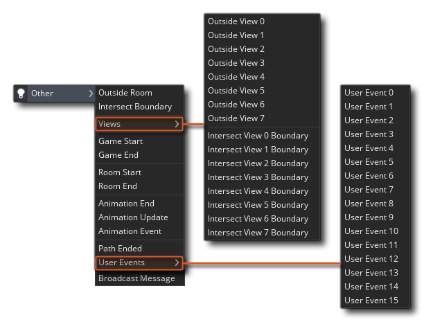

# The Other Events

本页说明在对象编辑器的“其他事件“类别下收集的每个不同事件：

## Outside Room

当实例离开房间时触发此事件，并且该事件基于对实例的指定精灵（及其属性）进行的检查，因此即使您将图像x或y缩放比例设置为除第一，仅当整个精灵不在屏幕上时才会触发此事件。如果该实例没有精灵，则使用该实例的位置，并且其x或y位置在房间外的那一刻，它也会触发该事件。此事件通常用于子弹之类的东西，一旦它们离开房间，它们就会被销毁，因此您最终不会导致数百万个子弹无限飞走并导致游戏速度减慢。请注意，此事件仅在实例最初离开房间时触发一次。

## Intersect Boundary 界面边界

当实例“触摸”房间的内部边缘时触发此事件，并且与OutSide Room事件一样，该事件基于对实例的指定精灵进行的检查，因此即使您已设置图像x或如果将y缩放为除1之外的其他值，则在子画面的一部分与房间边界相交时仍会触发此事件。如果实例没有精灵，则使用实例的位置，并且其x或y位置与房间边界相交的那一刻，它也会触发该事件。您可以使用此事件执行操作，例如告诉实例再次“反弹”回房间而不是外面。

## Views

摄像机视图通常在房间编辑器中定义，并且一次只能显示大房间的一小部分。此事件类别有两个单独的子类别（“外部视图”和“相交边界”），每个类别中有八个不同的事件，分别与八个可用的视图端口相对应。这两个类别的功能与相应的房间事件完全相同，只是将摄像机视图的边界作为要检查的实例而不是房间。

## Game Start

该特殊事件在整个游戏中仅触发一次，并且仅针对事件中包含动作或代码的那些实例触发。 这些实例必须存在于游戏的第一个房间中，并已放置在房间编辑器中，而不是使用代码或动作动态创建的。应该注意的是，该事件发生在所有实例的create事件之后，因此可以包含代码或具有该事件先前定义的变量的动作。此事件通常仅在一个“控制器”对象中定义，并且通常用于初始化全局变量，开始音乐，从文件读取以及通常在游戏开始时仅执行一次的任何其他操作。

## Game End

与上述“游戏开始”事件类似，此事件在整个游戏中仅触发一次，并且就在游戏窗口实际关闭之前。 同样，对于具有此事件的实例而言，实际上要执行任何操作都必须在游戏关闭时在房间中进行。请注意，此事件仅在Windows，Ubuntu（Linux）和macOS游戏中才真正可行，因为移动设备可能只是关闭了游戏而没有给GameMaker Studio 2调用的机会。 对于使用HTML5模块制作的浏览器游戏，当关闭游戏选项卡或浏览器时，此事件应起作用，但并非所有浏览器都支持此功能（在撰写本文时，Firefox，Chrome和Safari都支持此功能），因此在使用它时必须格外小心。通常，您将使用此事件保存数据。

## Room Start

房间启动时，最初在房间中的所有实例都会发生此事件。请注意，它发生在创建事件之后，因此可能取决于该事件中先前定义的变量和事物。

## Room End

房间结束时，该事件发生在房间中的所有实例上。此事件对于关卡结束后的“清理”非常有用，例如，您可以在此处删除加载的资源，或删除粒子系统以防止内存泄漏等。

## Animation End

在GameMaker Studio 2中，子画面不是静态的，因为它们可以具有子图像并以不同的速度进行动画处理。动画的每一帧（称为子图像）都有自己的编号，从0开始，可以通过代码或通过动作进行检查，但是有时您真正需要知道的是动画何时结束。就是在这个事件被触发时，恰好在动画的末尾，当子图像索引显示已到达最后一帧时。此事件对于许多事情确实非常有用，例如爆炸对象，您可以在其中设置实例以在到达动画的最后一帧时销毁自身。

## Animation Update

此事件仅设计用于骨骼动画功能。这是一个特殊事件，在使用骨骼动画精灵的实例中的每个步骤都会触发该事件，该事件旨在在为当前动画状态计算骨骼的方向之后但在提交该数据之前“拦截”骨骼数据用于绘图。 这使您可以使用适当的功能对骨骼数据进行修改。

## Animation Event

此事件仅设计用于骨骼动画功能。在已为其分配了骨骼动画精灵的对象中触发此事件，并且该对象正在使用分配的精灵的默认绘制，或者正在通过draw_self（）绘制该精灵。当前，它不会以任何其他方式绘制的骨骼动画精灵上触发。该事件旨在捕获和传输已分配给Sprite动画中特定事件的数据，如用于制作事件的编辑器中所定义。

触发动画事件时，将创建一个特殊的DS映射，称为event_data映射（与我们为异步事件拥有async_load映射相同）。该映射将具有以下所有键/值对，您可以对其进行解析以获得有关事件的信息：

- "**name**": 事件的名称（在动画程序中定义）
- "**track**": 播放动画的轨道的索引（默认为0）
- "**integer**": 与事件关联的整数值（在动画程序中定义，默认为0）
- "**float**":  与事件关联的浮点值（在动画程序中定义，默认为0.0）
- "**string**":  与事件关联的字符串值（在动画程序中定义，默认为空字符串”）

## Path Ended

路径可能是制作任何游戏的重要组成部分，无论是用于塔防类型的游戏，还是射击射击游戏或其他任何东西，并且当实例到达其末尾时执行某些特定动作通常非常重要小路。此事件将检测到此事件，并在发生该事件时触发该事件，使您可以添加代码或采取措施来应对这种情况，例如，在塔防游戏中，您可以使用此事件来破坏实例并从目标对象中删除生命值。

## User Events

这些特殊事件不是由GameMaker Studio 2自动触发的，而是必须由您在游戏运行时使用代码或操作隐式调用。总共有12个用户事件，它们可以包含代码或动作，可以在游戏循环中的任何时间调用它们，这使它们对于创建自己决定的事件非常有用。

## Broadcast Message

只要精灵或序列生成广播消息字符串，就会触发此事件。有关更多信息，请参见广播消息页面。

