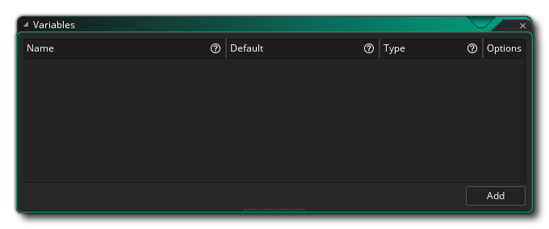
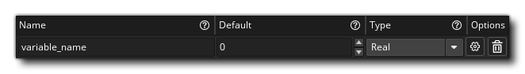
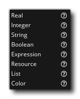
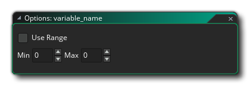
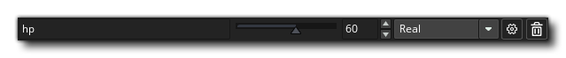
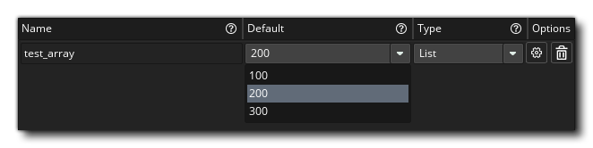
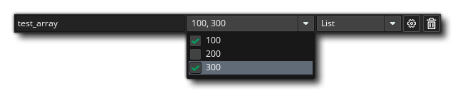
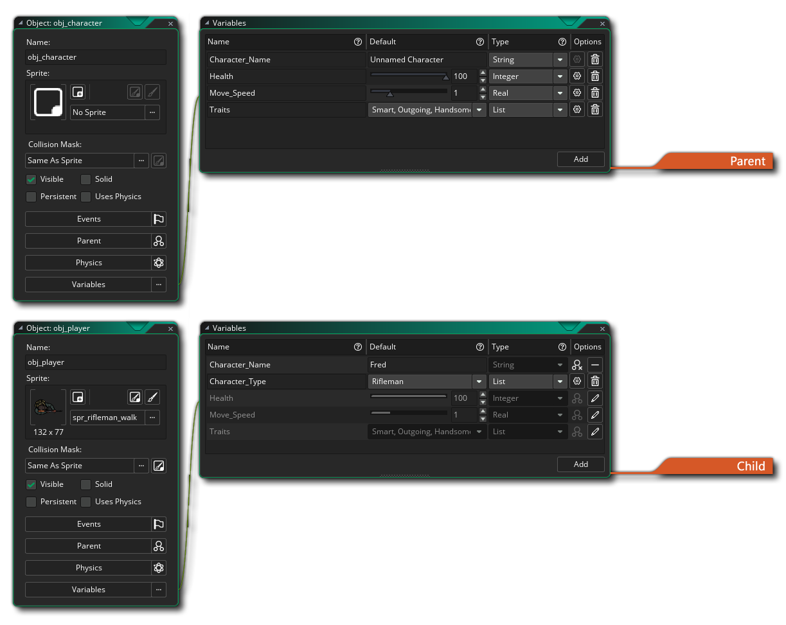

# Object Variables 对象变量

当您单击“变量”按钮时，它将打开“对象变量”窗口，然后您可以使用该窗口在对象的“创建事件”之前生成任意数量的变量：

在此窗口中，您可以单击添加按钮将新变量添加到列表中。然后，您可以命名变量以及设置其类型并调整其属性：

变量名称必须以字母开头，并且只能包含字母，数字和下划线符号“ _”，最大长度为64个符号。因此，有效变量是 ` fish` ，` foo_bar` ，` num1` 之类的东西，无效变量将是` 6fish` ，` foo bar` 或` * num` 。给出变量的名称后，需要设置其类型，可以是以下任意一种：

 

值得注意的是，此功能在处理父/子实例时特别有用-因为您可以使父对象具有一组定义的变量，然后只需在子对象中对其进行修改（请参见下面的“对象变量和子对象”部分更多详细信息）-以及在将实例添加到房间编辑器中时（请参见**Layers** > **Instance Layer**部分），因为您还可以为放置在房间中的单个实例修改这些变量。

下面列出了可以创建的不同类型的变量：

- **Real**: 实数是不是整数的任何数字，可以是正数或负数。因此，124.5、45639.566546456、0.9，-45.5等都是实数的示例。所有实数都存储为64位浮点值（双精度）。实数（和整数）数据类型具有用于设置值范围的选项，可通过单击选项按钮来访问这些值：

选中此选项后，您可以输入一个开始值和一个结束值，而不是在“对象变量”窗口中显示变量的固定值，而是将一个滑块固定在这些值上：

- **Integer**: 整数是整数，可以是正数或负数，例如30004、19、0，-300。请注意，您可以为输出整数设置一个值范围，如上面对实数所述。
- **String**:  字符串是放在双引号中的任何内容，例如“ fish”，“ Hello World”或“ 12345”。
- **Boolean**:  布尔值是true或false的值。在“对象编辑器变量”窗口中，它简单地显示为一个复选框，您选中了true，取消选中了false。
- **Expression**:  表达式是一个数学短语，可以包含普通数字，变量，字符串或GML函数以及一个或多个运算符。例如`sqrt（85 * 6）+ 5.5`是一个表达式。
- **Resource**: 资源只是您在资源浏览器中定义的任何一种资源。选择此资源类型后，可以单击打开资产浏览器按钮以打开资产浏览器并选择所需的资源。
- **List**: 选择输入的列表类型意味着您可以创建一系列值（可以是字符串，实数，表达式等），然后可以选择一个或多个值以返回变量。要定义列表中的项目，您需要先将它们添加到选项中（单击按钮）：

您可以从下拉菜单的主窗口中选择该项目作为变量的默认值：

 请注意，如果在“列表选项”中勾选了“多选”，则该变量将成为所有选定选项的数组：

- **Colour**:  颜色类型供您定义要存储在变量中的颜色值。您可以输入一个实数（从0到16777216，这将是一个alpha值255）或一个十六进制值（以$ RRGGBBAA的格式），或者您可以双击色样以打开拾色器并在那里定义颜色。

# Object Variables And Child Objects

对象变量的一个重要功能是它们可以被资产浏览器中的任何子对象继承（有关更多信息，请参见“Parent Objects”部分），这意味着您可以选择覆盖或更改其中的任何一个或全部如果您愿意的话。

当您创建另一个为其定义了变量的对象资源的子对象时，这些对象将显示在“对象变量”窗口中，如下所示：

您可以在顶部图像中看到Parent对象具有四个Object Variables，在底部图像中还显示了这些变量，仅“灰显”并且具有Inherited From Parent图标，以表明它们已被继承。如果您单击覆盖变量按钮，则可以编辑这些继承的变量，因此您可以调整范围滑块或值，或者从列表中选择其他项目等。请注意，在编辑父变量时，您只能更改定义的值，而不能更改名称，也不能更改变量选项。还要注意，您也可以向子对象中添加新的对象变量（在上例图像中，您可以看到“字符类型”是仅用于子对象的新对象变量）。

如果您已编辑了继承的对象变量，则可以单击Delete按钮以删除编辑，而不是变量。该变量仍将从父级继承，但会再次使用父级默认值。如果需要完全删除变量，则必须从父对象执行此操作。