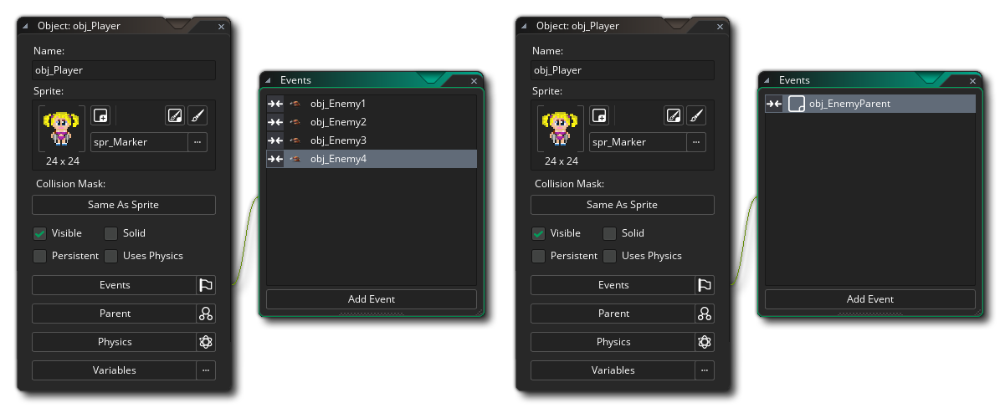
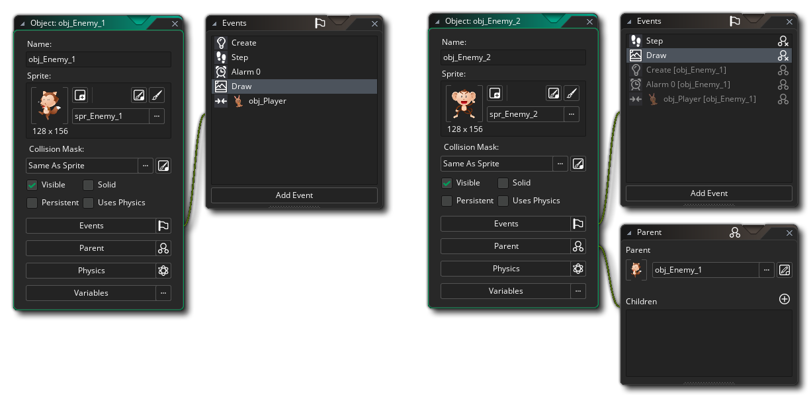
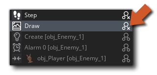
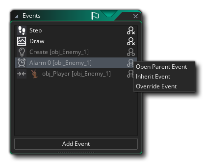

# Parent Objects 父对象

在GameMaker Studio 2 IDE中使用对象时，可以设置父级/子级层次结构。通过单击对象编辑器中的“Parent”按钮，然后从资源管理器中选择另一个对象作为要编辑的对象的“Parent”对象，可以完成此操作：

因此，您的游戏项目中的每个对象都可以有一个父对象，但这意味着什么呢？好吧，当为对象分配父对象时，它可以与该父对象共享代码，操作和事件。这种共享称为“继承”，而具有父对象的对象称为“子对象”。子对象不仅可以与其父对象共享代码，还可以在父对象上进行检查和运行代码，并且它还将自动包含子代对象，从而节省了大量时间和精力。

如果这听起来很复杂，那么查看父对象的另一种方法是在同一伞下将对象“分组”在一起并使它们共享某些东西而又不会失去自己的唯一身份的方法。也许这仍然不能使事情澄清太多，所以让我们举一些例子...

假设您有一个“玩家”对象和四个不同的“敌人”对象。现在，您希望玩家如果触摸到这四个对象中的任何一个，就会死亡，这通常会导致四个不同的碰撞事件，并产生四个不同的动作或代码集，每个敌人对象一个。但是，如果我们为所有敌人创建父对象，那么我们可以对父对象创建一个碰撞事件，并且无论四个“子”敌人对象中的哪一个接触玩家，它都会触发。方便的东西！在实际的GameMaker Studio 2对象中，您将看到以下内容：

在左侧，我们有四个单独的碰撞事件，在右侧，我们有一个碰撞事件，因为我们创建了一个“父”对象并为其分配了所有敌人对象。请注意，父对象不必在其中包含任何事件或代码...

继承的另一个示例是，如果您有一个游戏，想要创建10个不同外观的对象，并使它们的行为均相同。为此，您将创建一个父对象，并在必需的事件中包含所有行为操作或代码，然后您将创建十个对象，它们不包含任何动作或代码，但具有不同的Sprite，并为其分配父对象。现在，当您将这些实例放置在房间中时，它们的行为都相同，但是看起来却有所不同，因为它们将“继承”父对象的事件。

最后，您可以使用育儿功能来“混合和匹配”事件和行为。我们将用一个最后的例子来说明这一点。假设您想要两个怪物：一个怪物上下移动，另一个怪物左右移动，但是您还希望它们中的两个具有相同的生命值，向玩家射击并在碰撞时伤害玩家。在这种情况下，您可以看到几乎所有事件都应具有相同的动作，只有一个或两个控制运动。 因此，同样，我们可以使一个对象成为另一个对象的父对象，但是在这种情况下，我们还为子对象定义了某些事件。这些事件“覆盖”父事件，这意味着只要子对象的事件包含动作，就会执行这些事件，而不是执行父事件中包含的动作。如果您还想执行父事件，则可以使用函数event_inherited（）或DnD™操作“调用父事件”来调用所谓的“继承”事件。

上方左侧是其中包含5个事件的父对象，而右侧则可以看到“子”对象。子对象中也有5个事件，但是其中两个覆盖从父对象继承的事件（Step和Draw事件），而其他三个则变灰，因为它们是从父对象继承的事件。在事件编辑器中，继承的事件还将在其旁边带有“父替代”图标：

在已继承的事件上单击时，它将打开代码编辑器以显示继承的父代码，但是您将无法编辑此代码，因为只能在父对象本身中对其进行编辑。您可以在任何父事件上单击鼠标右键以打开以下选项菜单：

在这里，您可以选择两个“打开父事件”来检查代码，也可以选择“继承事件”或“替代事件”。如果选择继承，则代码编辑器将打开并已添加函数event_inherited（）（如果使用DnD™，则为调用父事件操作）。现在，您在此事件中放置的所有其他代码以及父对象具有的代码都将运行。如果选择覆盖事件，则代码窗口也会打开，仅现在不会调用event_inherited（）函数，因此将运行您在此处添加的任何内容，而不是运行父对象中的代码。

> 注意：在代码编辑器中，您可以通过单击鼠标右键并从弹出菜单中选择``转到对象''来快速导航到父对象，或者（如果事件已被覆盖）您可以选择``打开继承的事件''以直接转到到其中包含父事件代码的代码编辑器。

每当您在代码中定位父对象时，该代码也将同样适用于父对象的“子代”。当在动作中指示必须将该动作应用于某个对象的实例时会发生这种情况，而在代码中使用with（）语句时会发生这种情况。当您调用代码函数（例如instance_position（），instance_number（）等）时，它也将如此工作，其中-如果您提供父对象，则父对象和子实例的所有实例都将包含在检查中。最后，当您也引用其他对象中的变量时，育儿也可以工作，例如在上面的怪物示例中，如果将敌人1的速度设置为10，那么敌人2的速度也将变为10，因为它是敌人1的子对象。

通常，在大多数情况下，创建一个基础父对象并让该基础对象包含所有默认行为，但在游戏中不要使用其默认实例，通常被认为是一种好习惯。而是使用所有子对象，并且仅在类似我上面概述的情况下使用父对象，发生冲突，引用变量等。 您还应该意识到父母也可以有父母！显然，您无法创建“父级1是父级2的子级是父级1的子级”的循环，但是您可以创建“对象层次结构”，其中“父级3是父级2的子级是父级1的子级”。这对于保持游戏的结构性非常有用，强烈建议您学习使用此机制。

