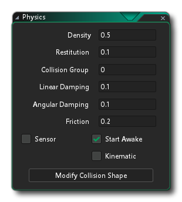
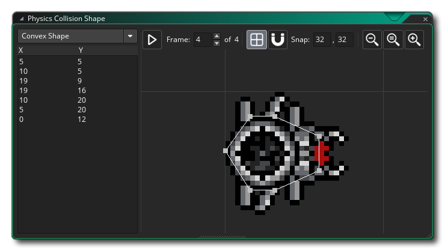

# Physics Objects 物理对象

首次创建新对象资源时，会出现一个标记为Uses Physics的复选框，默认情况下不会选中该复选框。选择此选项将在对象的实例放置在房间中时从根本上改变对象的行为，因为这会切换对象的物理属性，并意味着其“传统”运动和碰撞功能不再有效（但仅当它放置的房间也被标记为物理房间。请参阅``房间编辑器属性''部分。选中此选项后，对象资源窗口将为物理编辑器打开一个新的链接窗口：

在开始编辑物理行为的值之前，最好先设置碰撞形状。使用“正常”碰撞系统，您的碰撞基于分配给对象的精灵的蒙版，但是启用物理功能后，情况将不再如此。我们需要自己为对象分配一个碰撞形状（通常称为夹具，更多信息请参见物理功能），可以是您自己定义的圆形，矩形或多边形。单击“修改碰撞形状”按钮，将打开以下链接的窗口以编辑形状：

这看起来与“路径编辑器”相似，并且功能大致相同。但是，根据您选择的遮罩，它可能会更具限制性：

- 如果有圆形蒙版，则只能拉出任何路径点以使圆直径更大或更小
- 如果您有矩形遮罩，则可以移动四个角中的任何一个，但是相应的四个角将自动调整位置以始终保持矩形
- 如果您具有自定义（多边形）蒙版，则该蒙版必须具有最少3个，最多8个点，并且必须是凸形的（请参见下图）。

设置好形状后，您需要定义对象要具有的基本物理属性。通过更改以下参数进行配置：

## Density 密度

事物的密度定义为每单位体积的质量，这基本上意味着有多少质量塞满了它所占据的空间。因此，球囊由于其质量小而占据较大的空间而具有低密度，而铅条由于其质量大而具有较高的密度而又仅占据很小的空间。在GameMaker Studio 2 2D物理世界中，将根据您输入的密度值以及为灯具定义的形状的表面积自动为您计算质量。这将直接影响固定装置的惯性以及其对碰撞和力的反应方式，因此，如果您制作的小形状具有高密度，它将具有非常大的质量（如铅条），但是如果您定义一个低密度的大形状，则其质量会小得多（例如气球）。

请注意，将密度设置为0将创建一个``静态''夹具，该夹具本质上是无限密集的，并且不受外力或碰撞的影响，除非在特殊情况下将实例创建为运动学实例（有关更多详细信息，请参见下文）。

## Restitution 还原

在物理学中，恢复被定义为“物体或系统在弹性变形后返回其原始状态”，但是由于GameMaker Studio 2中的固定装置实际上是刚性物体并且不能变形，恢复实际上是一种表示如何进行恢复的方式。固定装置的“弹性”。此设置将影响一个对象与其他对象碰撞时“反弹”的程度，并且共同依赖于作用在该实例上的其他力，例如重力和摩擦力。

## Collision Group 碰撞组

 默认情况下，所有物理对象的碰撞组为0，这意味着它们将正常交互，这意味着它们必须具有碰撞事件才能相互作用（简单的注释将触发碰撞），否则不会发生碰撞被注册。但是，您也可以指定一个对象应属于特定的编号碰撞组。 通过将对象分配给正碰撞组（即，三个对象都在“ 2”组中），您就是在告诉GameMaker Studio 2，这些对象的实例应始终发生碰撞，即使它们在碰撞事件中没有任何作用，也要遵守物理属性您已经分配了他们以及他们所在的房间。相反，如果您的对象具有碰撞组为负的对象（即：四个对象被分配为“ -1”），您将告诉GameMaker Studio 2，它们永远不应碰撞，并且它们之间的任何碰撞事件都将被忽略。

> *注意：使用碰撞组会极大地增加物理系统所需的处理，并且仅在绝对必要时才应使用，并且应尽可能少地使用碰撞组。*

## Linear Damping 线性阻尼

阻尼用于降低实例在房间中移动时的物理世界速度。 原则上，这就像“真实”世界中与表面的摩擦，但是在GameMaker Studio 2物理系统中，摩擦实际上仅在两个具有碰撞形状（夹具）的实例接触时才应用。因此，您可以将线性阻尼视为更像是``空气摩擦''，它会随着时间的流逝逐渐降低任何移动的物理实例的速度，而无需与任何其他物理实例接触。

## Angular Damping 有角度的阻尼

如果您考虑``现实世界''中的任何旋转物体，除非它具有马达或在太空中，否则其旋转会由于外力的影响（例如机械摩擦或与周围空气或水的摩擦）而随着时间的流逝而减速它）。我们可以使用角度阻尼选项来模拟此效果并降低物理世界中实例的旋转速度，因为没有它，任何旋转的实例将继续无限旋转。

## Friction 摩擦力

摩擦力是抵抗材料元素彼此相对滑动的力，在GameMaker Studio 2物理世界中，摩擦力是由两个实例与物理夹具碰撞引起的动量损失。因此，当两个实例发生碰撞时，它们的运动会受到该值的影响，而高摩擦将导致动量损失大于低值。

最后，您可以将灯具的三个额外选项标记为“打开”或“关闭”：“传感器”，“开始唤醒”和“运动”。这些标志中的每一个都将通过以下方式更改灯具的行为：

## Sensor 传感器

通过选中此框，您可以告诉GameMaker Studio 2基本“忽略”对象的物理属性，但仍返回与周围对象的碰撞事件。这样，您可以拥有一个在房间中没有物理存在的实例，但是它可以对另一个实例（例如玩家）的碰撞做出反应，并依次执行某些操作（例如打开一扇门）或在另一个实例中触发某种动作放在房间里。

> 注意：仅在首次发生碰撞时，传感器固定装置才会触发碰撞事件，这意味着当两个物体继续重叠时（传统情况下会发生这种情况），您不会收到碰撞事件流。如果它们停止重叠并随后重叠，则会触发另一个碰撞事件。

## Start Awake 保持唤醒

默认情况下会对此进行检查，并表示其在放置房间的开始时的初始“状态”。通常，您希望它从一开始就醒着（即：参与物理世界），但是有时由于突然开始物理模拟，可能会导致某些不稳定性和不良影响。 为了避免这些影响，您可以取消选中此标志，并且实例将在灯具处于睡眠状态时创建，并且除非有其他作用，否则它将不参与物理仿真。

请注意，当物理实例不再处于任何运动状态或与任何其他物理实例发生交互时，它们将被标记为“睡眠”，并且“睡眠”实例只是物理仿真当前尚未完全处理的实例（节省CPU开销）。

## Kinematic 运动学上的

在基于物理学的游戏中，某些情况下您想四处走动，但又不想受到重力等力的作用，也不想与动态物体碰撞而产生的力（例如，在平台游戏中移动平台） ）。 对于此类对象，只需将固定装置的密度设置为0，就意味着物理学将假定该对象是静态的，并且对任何事物都不会产生任何反应。但是，选中此框将使静态对象运动，尽管它仍然不受碰撞和重力等影响，但现在可以使用适当的变量来移动或旋转它（例如，请参见phy_position_x和phy_position_y）。

