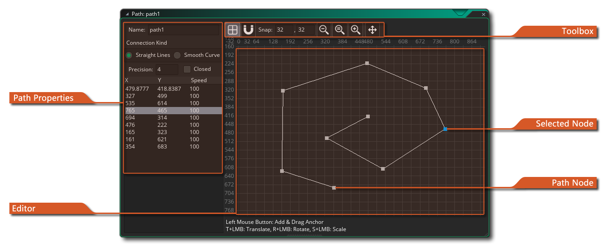
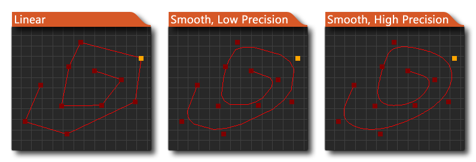
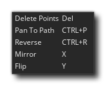
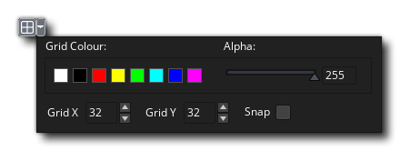

# The Path Editor 路径编辑器

在创建游戏时的某个时候，您可能需要一个实例来遵循通过关卡的路径。现在，只需在房间内创建一个位置数组，然后在它们之间移动一个实例，就可以用代码完成此操作，但这可能很麻烦，并且很难更改，测试和适应不同的实例。因此，GameMaker Studio 2具有路径资源和专用的路径编辑器。

基本思想非常简单-您可以通过在路径编辑器中绘制路径来定义路径，然后可以在对象的创建事件中放置一个动作（或代码），以告知实例遵循该特定路径。您还可以设置跟随路径的速度以及与房间内路径的位置和方向有关的许多其他操作。首次创建路径资源时，将打开路径编辑器窗口，其中包含以下选项：

## Path Properties 路径属性

与GameMaker Studio 2中的所有资源一样，您应该给您的新路径一个唯一的名称，因为这将在您制作的整个游戏中用来标识它，并且很多人都在使用一个好的系统作为前缀（或后缀） ），以便在代码或操作中轻松识别的资源（例如：path_Enemy_1或PowerUp_path）。

命名路径后，可以通过在右侧的主编辑器中放置点来开始定义路径，每个点以及其位置和速度都将添加到列表中。路径点的速度值由使实例沿路径移动的速度的百分比定义（默认值为100％）。因此，如果沿路径以2的速度（每步2像素）启动实例，然后路径点之一的速度值为50％，则当实例接近该点时其速度将降低为1 （路径速度的50％）。同样，您可以将速度设置为150％，实例将在达到该点时加速。这样，您无需任何代码就可以创建一些动感十足的动态外观。

值得注意的是，您可以在列表中的任何定义点上快速双击以将编辑器平移到所选点，或在其中一个值上缓慢双击以手动编辑它（x，y或速度）。

您还可以指定整个路径的连接类型以及是否应关闭路径（闭合路径会将路径上的最后一个点与第一个点连接起来）。连接类型可以是直线，也可以是平滑的，其中直线连接只是简单地以线性为基础连接路径的各个点，每个点的角度都发生变化，而平滑的连接将创建一条柔软得多的路径，该路径可能不会直接通过通过任何点，而是走一条近似线，使用平滑插值创建漂亮的曲线。您还可以指定曲线的精度（默认值为4），精度可以是1到8，其中8是最平滑的。下图显示了这些选项如何影响路径的示例：

## Path Editing

您可以在编辑窗口中的任意位置单击以将点添加到路径中，所有后续单击将添加更多点。放置到编辑器中后，可以通过单击并拖动它或通过更改左侧显示的X和Y位置和速度的值来移动点（请参见上面的路径属性）。您可以使用//并在多个点上单击鼠标左键以将它们一起选择，然后可以根据需要将这组点拖动并放置。您也可以按删除所选的一个或多个点。

右键单击时，在编辑器窗口中有一个附加菜单供您使用，如下所示：

该菜单中的每个项目都如下工作：

- **Delete Points** - 删除所选点。
- **Pan To Path** - 平移到路径-将编辑器中的视图平移到路径的中心。
- **Reverse** - 反转-反转路径点的顺序。这不会移动它们，而是会更改处理它们的顺序，以使起点成为终点，反之亦然。
- **Flip** - 翻转-沿水平轴翻转路径。
- **Mirror** - 镜像-沿垂直轴翻转路径。

## The Toolbox 工具箱

您可以在顶部的工具箱按钮中控制在编辑器窗口中绘制事物的方式。您可以打开或关闭背景网格，以及将路径点的添加设置为是否捕捉到该网格：

捕捉值指示网格单元的大小，可以将其更改为所需的任何值。其余工具专用于放大和缩小以及平移编辑器区域，您可以单击按钮将显示重置为1：1。请注意，如果您平移了您想要绘制路径的位置，则可以使用鼠标右键菜单，然后单击`Pan to Path`以滚动回到工作位置。

## Path Points

路径只是一条线连接在一起的点的集合。在编辑器中，使用鼠标左键放置这些点。您可以在房间编辑器中的任何位置添加点，它们将连续添加到点列表中以构成路径。如果将点放置在连接线或另一个节点附近，则新点将插入到路径中而不是添加到路径中（您可以在“首选项”中为此设置检测距离）。您可以按/并在已放置的点上单击以选择它们，然后对路径点执行的任何操作（如移动它们）将作为一组应用于所有选定点。 要删除点或选择点，您可以右键单击并选择`Delete Poin`或按键。

请注意，您还可以使用以下快捷方式执行一些额外的操作，这些操作无法通过选择路径点上的鼠标右键菜单进行：

- T + : 平移（移动）路径点
- R + : 旋转路径点
- S + : 缩放路径点