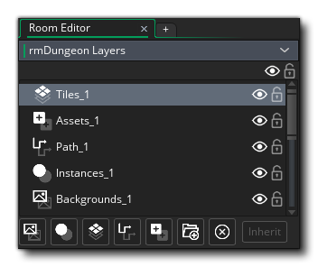
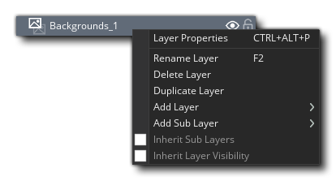
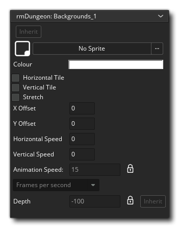
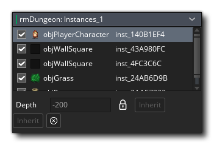
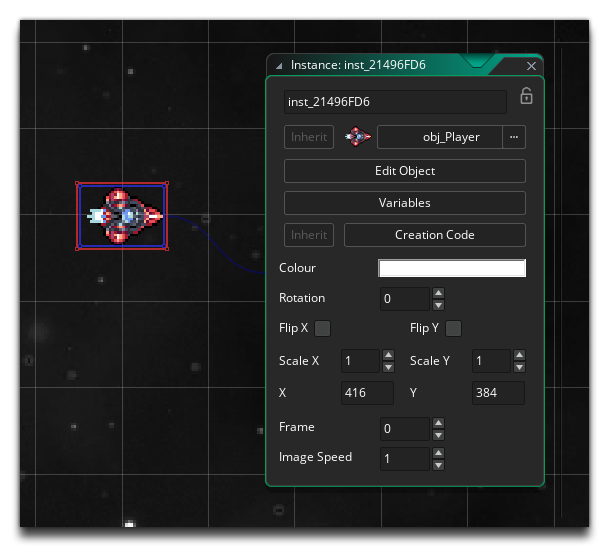
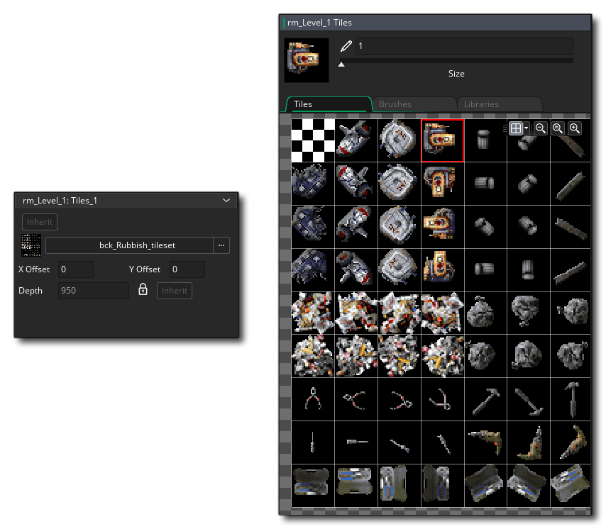
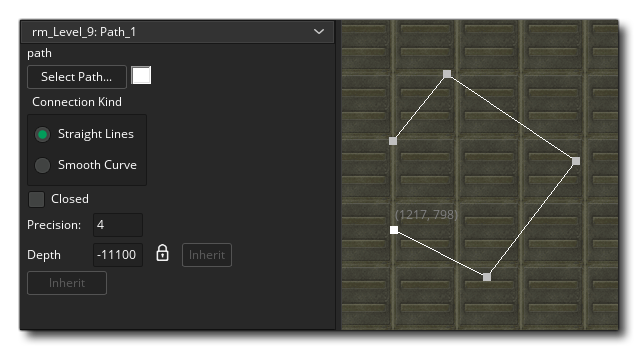
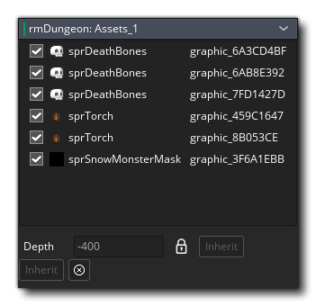
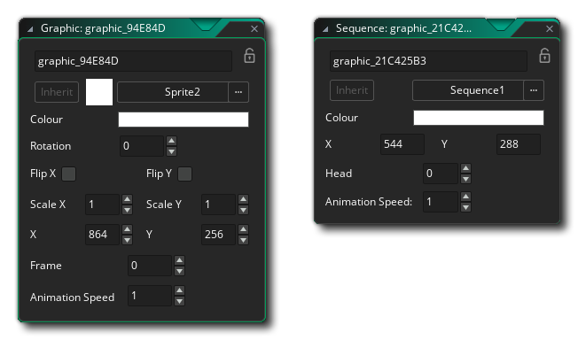

# Layer Types And Properties 图层类型和属性

您在“Room Editor”中创建的房间中的所有内容都放置在一个图层上。可以从“Layers Editor”中添加，删除和排序图层，并且可以使用各种不同的类型，每种类型都有其自己的一组选项和工作方式。您不受限于每种类型的层数，并且可以具有多个图块层，路径层或实例层等。每种类型的图层都有其自己的属性窗口，您可以在其中根据图层类型设置不同的内容。您还可以切换图层的可见性，在运行时不处理不可见的图层（但是您可以随时使用适当的图层功能使它们再次可见）。

上图显示了层编辑器，当前层在顶部列出，而用于创建层的不同按钮在底部列出。您可以通过缓慢双击名称来从此编辑器重命名任何图层（请注意，除了字母数字和下划线“ _”字符以外，您不能使用其他任何名称），还可以通过单击眼睛图标。如果房间已从父房间继承了图层，则可以从底部的按钮切换继承，但是请注意，这将影响所有图层（有关继承的更多信息，请参见[here](https://manual-en.yoyogames.com/The_Asset_Editors/Room_Properties/Room_Inheritance.htm) ）。您还可以使用或/并在多层上单击鼠标左键以选择要复制或删除的图层（这些选项也可从右键菜单中获得）。

为了帮助排序图层并使它们保持整洁，您可以通过单击文件夹图标在图层文件夹中创建图层组。您也可以通过单击删除按钮来删除一个或多个选定的图层。所有图层都有一个深度值，该值定义了在房间中渲染其内容时该图层在绘制顺序中的放置位置。 从最高深度到最低深度绘制图层，因此将在深度为200的图层上绘制深度为-100的图层。

> 注意：最小和最大层深度为-16000至16000。尽管所有事件对于该层上的任何内容仍将正常运行，但不会绘制该范围之外的任何内容。

如果在任何图层上单击鼠标右键，将显示图层菜单：

在这里，您可以打开所选图层的图层属性窗口，删除图层，重命名图层或添加子图层。如果选择添加子层，则当前层将收到一个“文件夹”图标，以显示有附加的子层，并且将在其下创建新层，并在右边显示。然后，您可以选择让子层从父层继承其属性，还可以设置是否应从父层继承可见性。

请注意，您可以在窗口中上下拖动图层以对其进行重新排序，也可以使用+选择从一个图层到另一个图层（包括中间的所有图层）或使用/ +来选择和移动多个图层。一次一个。 如果将图层放置在图层文件夹的顶部，它们将被移动并设置为放置它们的文件夹的子图层。您还可以锁定图层，以便使用锁定按钮不会错误地编辑它们。

> *注意：在实际的编辑器窗口中，您可以将不同的资产放置在它们的层上，您可以在任意位置按住'P'+来立即选择该资产并跳到放置该资产的层。*

您可以在下面找到每种可用图层类型的概述以及该图层的可编辑属性：

## Backgrounds 背景

您可以通过单击按钮添加新的背景层。这将添加新层，然后打开背景属性窗口：

创建新的背景层时，默认情况下该层为空，因此将绘制定义的背景色。如果未为背景图层图像分配精灵，则将改为绘制此图片，并且您可以单击颜色框以打开颜色选择器并更改使用的颜色。如果确实选择了精灵，则可以勾选平铺选项以将其水平或垂直平铺，或使其拉伸图像以填充整个房间。

 如果您想让背景朝某个方向滚动，您也可以设置水平和/或垂直速度（每个游戏步骤，它都会沿给定的访问方向移动您在此处设置的像素数），并且您还可以重新设置通过设置x和y偏移值来定位背景图像。如果您选择的Sprite资源具有多个子图像，您也可以设置背景的动画速度，尽管默认情况下该资源被锁定为您在Sprite Editor中为所使用图像设置的值。最后，您可以显式设置图层的深度，尽管默认情况下仍被锁定，并且您可以简单地在“图层编辑器”中拖动并重新排列图层顺序以更改此值。

请注意，您也可以通过单击最顶部的按钮来从此窗口切换背景的继承。

## Instances 实例图层

您可以通过点击按钮添加一个新的实例层。这将添加新层，然后打开实例属性窗口：

该窗口仅显示该层上当前所有实例的列表。您可以通过打开资源浏览器然后将对象从其中拖到房间中来向图层添加更多实例，或者您可以从资产浏览器中选择一个实例，然后按住以在原地预览资源，如果您另外单击鼠标左键，则可以添加实例，甚至可以通过按住按钮并移动鼠标来将其“绘制”到房间层中。

可以通过单击并将列表中的实例拖动到所需位置来对图层列表进行排序，但是值得注意的是，这纯粹是出于房间编辑器的组织目的，如果要设置特定的创建顺序，请使用创建订单窗口，可以从“房间属性”窗口或“房间”上下文菜单中打开。

在房间编辑器本身或属性列表中的任何实例上双击都会打开一个新窗口，让您修改单个实例的各个方面：

默认情况下，该实例的名称类似于'inst_38B0BFF'，但是可以将其更改为所需的任何名称，只要该名称仅使用字母数字字符和下划线'_'（且不包含空格）即可。但是，值得注意的是，此处给出的名称（无论是您提供的名称，还是IDE提供的默认名称）都被认为是常量，因此实例必须唯一。这也意味着它可以在您的游戏代码中用于标识实例，但前提是您与实例位于同一房间。

在实例名称下方，您可以使用按钮设置该实例是否要从父空间继承，更改您希望其成为实例的对象，或者打开对象编辑器（如果您要在其中进行任何更改）。有一个按钮可通过“对象变量”窗口检查和编辑变量，您也可以更改此实例的初始特征，设置颜色以使其与之混合（默认为白色），或者旋转和翻转它。您还可以沿任一轴或两个轴缩放实例，并设置其在房间内的位置，以及图像速度和供精灵使用的初始帧。

最后，您可以为实例提供一些创建代码，该代码将在对象创建事件代码之后直接运行，并且对于该实例是唯一的（因此，您可以在对象中设置一个变量，所有实例将在创建该对象时对其进行修改代码，以便它是一个实例的唯一值）。单击此选项会将脚本窗口链接到实例，您可以在其中添加任何功能或修改任何变量，并且在创建实例并运行实例Create Event之后将直接运行此代码。请注意，您可以独立于实例继承打开或关闭创建代码的继承。

值得注意的是，制作游戏时，图层上的每个实例都会自动标记为导出。但是，尤其是在处理继承时，可能是您不想在最终游戏中将特定实例添加到房间中（或者您可能在每个房间中都有一个调试实例，只是想将其从最终游戏中排除） ）。如果是这种情况，则只需取消选中列表中实例左侧的“导出”复选框，即可防止将其导出为可执行文件的一部分。但是，请务必注意，如果您有任何引用实例的代码，则游戏将无法正常运行，因此请谨慎使用此功能。

## Tile Maps 图块

你可以通过点击按钮添加一个新的平铺地图层。这将添加新图层，然后打开`Tile Map Layer Properties `窗口和`Tile Editing`窗口：

如果您希望图层网格与（0，0）不完全对齐，则可以在``平铺地图图层属性''中切换图层的继承，更改正在使用的平铺集并设置图层的x或y偏移量房间的位置。您还可以设置渲染层的深度（具有其自己的唯一继承按钮），也可以“锁定”该深度，这将防止在创建之后进行任何进一步的编辑。

图层属性窗口打开时，还将打开“平铺编辑”窗口，其中显示了正在使用的平铺集（如果错误关闭此窗口，则可以从IDE顶部的**Room** > Tile Editing 菜单中再次将其打开） 。您可以在任意图块上单击以将其选择为当前画笔，然后通过在房间画布上单击来将它们绘制到房间编辑器中的图层上;或者，如果要一起绘制多个图块，可以通过单击将它们作为一个组进行选择鼠标左键并拖动以在绘制之前从图块集中选择它们。如果要绘制的图块范围不是一个块，则可以按住/然后使用鼠标左键选择单个图块并以此方式创建自定义画笔（也可以从自定义画笔中删除图块使用  + ）。请注意，以这种方式创建自定义笔刷是临时的，并且设计为一次性使用，但是您可以使用``笔刷''选项卡创建永久笔刷，该笔刷将与图块地图图层一起存储。

请注意，``图块编辑''窗口允许您使用鼠标滚轮或顶部的按钮来放大和缩小图块，并且可以使用鼠标中键或  + 平移。请注意，也有一个网格选项可以打开或关闭以界定窗口中的图块，并且您也可以设置网格的颜色，尽管无论是否可见图块都将始终对齐到网格。

“图块编辑”窗口还允许您从“库”选项卡中选择“笔刷”，“动画图块”和“自动图块”，所有这些都在“图块集编辑器”部分中进行了介绍。

在房间编辑器的顶部，选择了瓷砖图层后，您将看到一组特定于瓷砖的工具：

| **Pencil [ 铅笔]** | 这是铅笔工具. 它使用选定的图块在``房间编辑器''中用鼠标左键进行绘制，您可以用鼠标右键进行擦除。请注意，图块的索引值显示在“房间编辑器”的“房间状态栏”的底部，如果您选择了多个图块进行绘画（即画笔），则会显示所有使用的图块索引的列表。 |
| ------------------------------------------------------------ | ------------------------------------------------------------ |
| **Eraser [ 橡皮]** | 使用橡皮擦工具，您可以使用鼠标左键在房间编辑器中擦除给定的瓷砖。本质上，所有这些操作都是将图块索引设置为0，这是保留的“空”图块。 |
| **Fill [ 充满]** | 填充工具允许您使用当前的图块画笔来填充整个图块地图图层或某些图块。您使用的笔刷可以是单个图块，也可以是由多个图块组成的复合笔刷，甚至可以是动画库中的一个图块，然后在图层上单击将使用所选笔刷填充这些图块。如果未使用选择工具，则填充将在所有连续的空图块或同一索引的所有连续的图块上进行。如果您在图层中有一个选择，则填充将被限制在该选择之内。 |
| **Line [ 线]** | 选择`Line Tool`时，单击然后拖动并释放将在您单击的位置和释放的位置之间创建一条平铺线。如果使用“选择工具”选择了瓷砖地图图层的某个区域，则仅在选择范围内添加线。 可以使用库中的单个图块笔刷，各种图块的复合笔刷或动画图块绘制线条。 |
| **Rectangle [ 长方形]** | 选择矩形工具后，单击然后拖动并释放将创建一个填充的矩形矩形，其中左上角是单击位置，右下角是释放位置。如果使用“剖面工具”选择了tilemap图层的某个区域，则矩形将仅添加到选择范围内。可以使用单个图块画笔，各种图块的复合画笔或库中的动画图块绘制矩形。 |
| **Selection [ 选拔]** | 这是选择工具，可用于定义要处理的图块层的区域。 您可以单击鼠标左键，然后拖动鼠标以创建一个矩形区域，或者可以按// +添加多个选择，并按 + 清除选择的一部分。要清除整个选择，可以按。当您选择了图块图层的区域时，其余工具（“铅笔”，“翻转”，“旋转”等）将仅在所选区域内起作用。请注意，您还可以在房间编辑器中复制（ / +'C'），剪切（ / +'X'）和粘贴（ / +'V'），然后将工具切换到铅笔并允许您用选定的瓷砖绘制房间图层。 |
| **AutoTile [ 自动平铺]** | 单击此工具将启用“自动平铺”绘画样式。启用此选项后，您可以从“自动拼板库”选项卡中选择任何图块，然后将其绘制到房间图层中，只要您正确设置了“自动图块”选项卡，GameMaker Studio 2就会自动更改它以匹配周围的图块。 请注意，从图块集中选择不属于autotile库的图块，会将绘图工具重置为标准“铅笔”工具。 |
| **Inheritance [ 遗产]** | 使用此工具，您可以启用/禁用给定层上特定图块的继承。为此，房间必须首先是子房间，并且图层必须在图层属性中启用继承。 在这种状态下，房间编辑器默认会将所有继承的图块着色为红色，然后单击鼠标右键将关闭该图块的继承，然后单击鼠标左键将其重新打开。这样，您可以重复使用“基础”房间中的元素，而仅在继承所有其余部分的同时选择性地更改所需的图块。 |
| **Flip [ 翻动]** | 用鼠标左键单击``翻转''工具（或使用键盘快捷键'X'）将沿水平轴翻转当前选择用于绘制的图块，而无需更改绘制工具（如果您选择了自定义画笔来绘制，则整个画笔会翻转）。如果您没有选择要绘制的图块，而是在图层上选择了一组图块，则翻转工具将翻转选定的图块。 |
| **Mirror [ 镜子]** | 用鼠标左键单击Mirror工具（或使用键盘快捷键'Y'）将沿垂直轴镜像当前选择用于绘制的图块，而无需更改绘制工具（如果您选择了自定义画笔来绘制，则整个画笔将镜像）。 如果您没有选择要绘制的图块，而是在图层上选择了一组图块，则“镜像”工具将镜像选定的图块。 |
| **Rotate [ 旋转]** | 用鼠标左键单击旋转工具（或使用键盘快捷键'Z'）将顺时针方向将当前选择用于绘制的图块旋转90°，而无需更改绘制工具（如果您选择了自定义画笔来绘制，整个画笔将旋转）。如果您没有选择要绘制的图块，而是在图层上选择了一组图块，则“旋转”工具将旋转选定的图块。 |

请注意，如果您使用``选择工具''在房间编辑器画布中选择一组瓷砖，然后剪切或复制它们，则它们将暂时成为当前绘画用的画笔。

##  Paths

您可以通过单击按钮添加新的路径层。这将添加新层，然后打开路径属性窗口：

在这里，您可以从资产浏览器中选择要用于图层的路径，然后更改定义的连接类型（使用平滑插值或直线），以及是否关闭该路径以及创建路径的精度。还要注意，您可以在此处切换继承，并且可以将路径设置为特定颜色（默认为红色），以使在编辑器中更好地看到它们。如果没有定义路径资源，则可以单击“新建”按钮来创建路径资源。路径层也具有与之关联的深度值（默认情况下为锁定），即使使用它们时游戏中实际上并未渲染任何东西。

值得注意的是，您还可以通过单击鼠标左键在路径中添加点，以及使用鼠标右键删除点，或通过在其上拖动并拖动来选择一个点，所有这些都在实际的房间编辑器中完成，使创建和编辑路径非常容易（尽管您仍然可以照常在路径编辑器中编辑路径）。如果在不同的路径点上按住  /  + ，则将全部选中它们，您可以将它们一起移动或从菜单选项中将其全部删除（如下所述）。

如果在操作路径时在房间编辑器窗口中单击鼠标右键，将获得以下选项：

在这里，您可以反转路径方向（这几乎看不到效果，但是可以反转计算路径点的顺序，因此起点变成终点，反之亦然），也可以水平或垂直翻转它们。您也可以从此菜单中删除选定的点。请注意，您可以按住'T'，'S'或'R'然后单击并拖动以平移，缩放或旋转整个路径。

##  Assets

您可以通过点击按钮添加一个新的资产层。这将添加新层，然后打开资产层属性窗口：

资产层只是一个独立于实例而已放置到房间中的图形资产（子图形或序列），您可以通过从资产浏览器中将它们拖入或在资产浏览器中选择所需的一个来放置它们。然后使用  +  对其进行“绘制”。Sprite资产类似于tile，只有它们可以完全动画化-如果所使用的sprite具有子图像，则将显示它们-没有针对tile的适当限制，即：它们不被强制网格化并且动画可以任何长度和速度。序列是进入房间时将播放的精灵，声音和实例的“偏转”。

将资产放置在资产层上时，它们将捕捉到在网格的房间编辑器顶部设置的网格捕捉值，但是如果要徒手放置它们，只需关闭网格或使用键 /  和鼠标左键按钮 。在按住这些键的同时，您可以自由地将资产放置在任何地方，而不必依赖于网格分辨率。

将资产放置在房间中后，您可以双击它以打开资产属性窗口，从而对其外观有了一定程度的控制：

在这里，您可以给资产指定一个唯一的名称，设置是继承自父房间，还是更改想要显示的精灵或序列。对于连续镜头，您可以设置动画速度和初始播放头帧以及要与之混合的颜色（默认为白色）和房间中的位置。您也可以更改Sprite资产的特征，设置颜色使其与之混合（默认为白色），或旋转和翻转它。您还可以沿一个或两个轴缩放精灵，并设置它们在房间中的位置。如果子画面具有子图像，则可以选择动画速度以及设置要显示的初始帧。

值得注意的是，制作游戏时，层上的每个资产都会自动标记为导出。 但是，尤其是在处理继承时，可能是您不希望在最终游戏中将特定的精灵添加到房间中。如果是这种情况，则只需取消选中图层属性列表中子画面左侧的“导出”复选框，即可防止将其导出为可执行文件的一部分。但是，请务必注意，如果您有引用该资产的任何代码，则游戏将无法正确运行，因此请谨慎使用此功能。