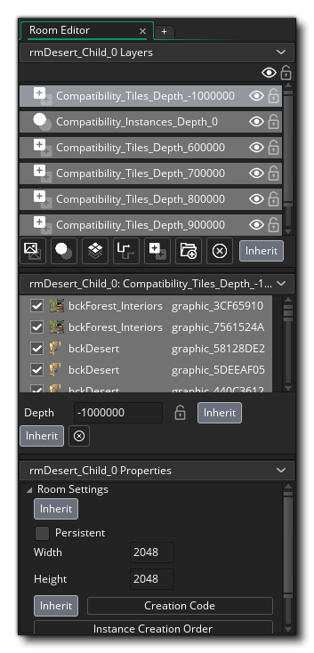
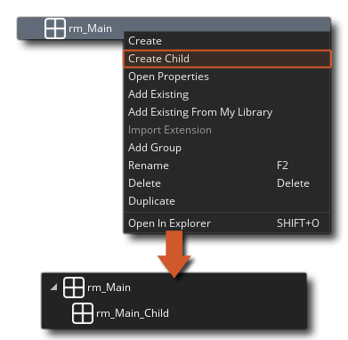

# Room Inheritance 房间继承

房间编辑器的一个重要功能是继承。继承意味着您可以创建一个“父”房间，然后从中创建一个“子”房间，该子房间将继承所有父房间的属性。此子房间实质上是父房间的克隆，其中的所有内容都链接到父房间。这意味着，如果您在父视图中更改视图，移动图块或添加实例，它将反映在子房间中。不仅如此，在子房间中，您可以有选择地关闭特定层，实例，资产或其他任何所需的继承。

具有继承属性的房间将使继承按钮亮起-如下图所示-然后您可以使用它们来为给定的图层或资源等打开或关闭继承。

乍一看这可能会有点困难，所以让我们看一个例子：假设您有一间房间，中间有一座城市和一座城堡。城市和城堡是使用不同的图块图层绘制的，并且您还具有实例和一些NPC可以走动的路径。您想要拥有它，以便在游戏中城堡被摧毁，但城市中的其他一切看起来和行为都一样。您将创建具有所有常规功能的初始房间，然后创建一个继承父房间层的子房间。在子房间中，您将关闭城堡区域的图块层（甚至单个图块）的继承，它们将移动/添加/删除图块以创建被破坏的城堡外观。当玩家进入该房间时，父房间中的所有实例以及所有瓷砖等都将保持完全相同，除了那些被摧毁的城堡之外。

> 注意！如果您编辑任何继承的属性，它将自动在其所属部分中关闭继承，而无需先切换“继承”按钮。

要创建房间继承，只需在“资源浏览器”中选择要创建子房间的房间，然后单击鼠标右键。这将打开房间菜单，您可以在其中选择**Create Child**来创建新的子房间。这将在资源浏览器中可视化地创建并“附加”到父级：

要更改房间顺序和/或继承，您需要使用“房间管理器”，您可以使用“资源浏览器”右上方的菜单将其打开。在这里，您可以转到``继承''选项卡，然后单击并将任何房间拖到任何其他房间，以使其成为该房间的子房间（或将子房间拖离父房间并中断继承）。

请注意，在一个房间内，继承是多层的，您可以检查单个项目，单个图层上的项目组，项目属性或整个房间是否进行继承，也可以从连续房间继承（因此，房间C继承自B室，而B室又继承自A室）。例如，如果您创建一个除了视图设置以外就什么都没有的基础房间，则可以将所有其他房间创建为它的子房间，它们都将继承父房间的视图属性。但是，您可以更进一步，以“ view”房间作为其父级来创建另一个基础房间，其中包含常规GUI实例和每个游戏室所需的控制器。现在，您可以从中创建子房间，它们将从父房间继承控制器和GUI，并从该父房间继承视图设置！

如您所愿，继承功能非常强大，您可以使用它来维护更整洁的房间结构，加快工作流程并总体上优化花在设计和设计房间上的时间。