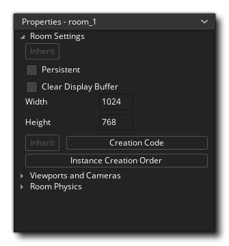
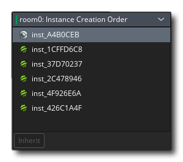
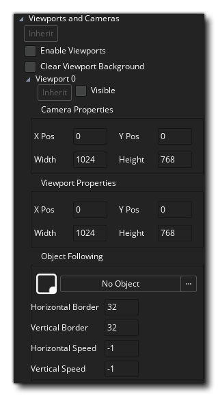
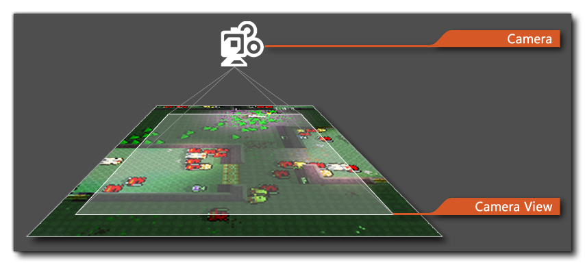
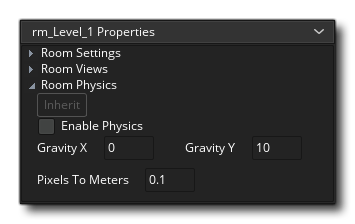

# Room Properties 房间属性

在“房间属性”部分中，您可以在此处设置设置的继承开关，以及为房间命名以及它是否为持久性。通常，当您离开一个房间并稍后返回同一房间时，该房间将重置为其初始设置。通常，这对于大多数游戏来说都可以，但是可能不是您想要的，例如RPG或任何非线性游戏，您想要在各个房间之间来回走动，让它们成为您上次离开的方式。选中标记为Persistent的框即可完成此操作。房间状态将被记住，当您稍后返回时，它将与您离开时的状态完全相同，只有在重新启动游戏时才会将其重置为开始状态。 请注意，这是一个例外-如果您将某些对象标记为持久对象，则该对象的实例将不会留在房间中，而是会移至下一个房间。

之后，您可以选择清除显示缓冲区。选中此选项时，将用一种颜色填充显示缓冲区。如果您知道视图将始终覆盖整个屏幕，或者您已绘制了全屏背景，则可以取消选中此复选框（这样可以节省重新绘制的内容，从而有助于优化游戏），但是如果您具有重叠的视图，这些视图在屏幕上留下空白区域或背景具有任何透明度时，应进行检查，以确保没有视图的区域被您选择的绘制颜色填充。目前，只能使用window_set_colour（）通过代码设置此颜色。

> 注意：如果您正在使用自动纵横比校正（在“游戏选项”中设置），则应始终选中此选项，否则在绘制游戏的“信箱”中可能会得到奇怪的效果。如果您不使用此选项，则可以取消选中此选项，并可以小幅提升游戏性能（在Android和其他移动平台上尤其明显）。

房间必须具有大小，该大小由您输入的宽度和高度（以像素为单位）的值来定义，一旦设置好，您就可以继续添加创建代码（如果需要）。创建代码是从底部的按钮添加的（带有“继承”开关以指示房间是否应该继承其创建代码），如果单击它，则将打开代码或DnD™编辑器。该编辑器允许您输入将在会议室开始时，所有实例的create事件之后，但在其会议室开始事件之前运行的功能/动作和代码（有关事件顺序的更多信息，请参见此处）。该代码将在您每次进入房间时运行，除非房间被标记为永久房间，在这种情况下，该代码仅在首次进入房间时才运行一次，但不会在随后的访问中运行一次。

房间属性中的最后一个按钮允许您打开“实例创建顺序”窗口：

此窗口按创建顺序列出了房间中的所有实例（从上到下）。如果您需要先创建特定实例，则只需单击并将其拖动到所需位置即可。请注意，将按照列表顶部到底部的顺序创建实例。

# Cameras And Viewports  相机和视窗

您可以定义的房间的下一组属性是与房间``摄像机''和``视口''有关的属性。摄像机视图提供了一种机制，可以在屏幕上不同位置绘制房间的不同部分，或者仅绘制房间的一部分以覆盖整个屏幕。例如，在大多数平台游戏中，摄影机视图跟随主要角色，因为，如果您可以在屏幕上看到整个关卡，则您的角色将太小而看不见，并且不会给玩家带来惊喜。摄像机视图还可以用于多人游戏或合作社游戏，因为它们允许您创建分屏设置，在该设置中，您可以在屏幕的一部分看到一个玩家，而在另一部分看到另一个玩家。 这可以在GameMaker Studio 2中使用相机视图轻松实现。

在视图属性的顶部，可以打开或关闭视图继承，然后有一个标记为“启用视口”的框。必须先标记此标记，然后才能在游戏中激活任何摄影机视图。

> *注意：您可以为三个主视图端口设置打开或关闭继承，然后为每个单独的摄像机视图打开或关闭继承。*

下一个复选框是“清除视口背景”复选框，该复选框使用窗口颜色清除应用程序表面，如果您知道要覆盖整个表面，则可以不选中该复选框。

摄像机视图由两组不同的值定义，摄像机视图本身和要在其上绘制该视图的屏幕上的端口。有时这可能会引起混乱，因此让我们在解释如何定义它们每个之前先对其进行一些解释：

- **The Camera**: 房间内的一个点，用于设置房间在屏幕上的显示方式（这是房间编辑器中的一个抽象点，其位置根据查看和查看端口设置自动设置）
- **The View**: 根据相机的位置，投影和旋转，相机看到的内容
- **The View Port**:  物理屏幕上将显示摄像机视图的区域

因此，例如，这意味着您可以将640x480的摄像机视图放到您的房间中，然后将端口设置为320x240，这将在屏幕上按比例缩小视图的大小显示该视图，您也可以执行相同的操作并将视图设置为较小的值，将端口设置为较大，以使图像放大到适合端口大小的大小，并且在屏幕上显示的内容将大于实际大小。这样，您可以在更改摄像机视图的同时保持屏幕（端口）的大小，以在屏幕的同一区域显示更多或更少的房间。

摄像机视图始终定义为房间中的矩形区域，您可以在其中指定左上角的位置，该区域的宽度和高度。然后，您必须通过定义视口来指定此区域在屏幕窗口中的显示位置，再次在该位置指定左上角的位置和大小（请注意，左上角的值不是0,0）可以给出奇怪的结果）。您可以有多个端口，并且它们可以重叠，在这种情况下，它们会按指示的顺序一个接一个地绘制。

请注意，整个屏幕区域始终被定义为矩形区域，因此即使偏移了端口，您的端口也将形成一个矩形，任何空白均由显示缓冲区的窗口颜色填充，这意味着在这种情况下，应该始终检查“清除显示缓冲区”，否则您将在端口之间的空间中看到奇特的伪影。下图说明了这一点，其中有两个可见的偏移视口，但它们形成一个正方形窗口，并且在“下方”有一条线绘制到显示缓冲区：

相机还具有“对象跟随”选项。这是当您希望摄像机“跟随”（即：保持视图聚焦）某个对象时。为此，您必须单击菜单图标上的并从弹出的列表中选择一个对象（如果房间中有该对象的多个实例，则相机仅跟随其中的一个实例）。

相机的正常行为是仅在跟随实例的位置过于靠近“缓冲区”区域（该区域在视图边缘周围形成不可见边界）时移动。您可以使用“水平边框”和“垂直边框”值来定义此区域，因此-例如-将这些值设置为64将意味着视图将不会开始移动并跟随字符，直到从边缘到64像素为止。看法。

 最后，您可以指示角色到达缓冲区时摄像机移动的水平和垂直速度，默认值为-1。该默认值基本上是“即时”的，表示跟随实例在水平边框或垂直边框缓冲区之外时，视图将跳至其当前位置。 现在，这并不总是您想要的，因此您可以通过将值设置为-1以外的值来设置摄像机的垂直和水平滚动速度。请注意，值0会导致视图完全不移动，而其他任何正值都是该视图在任何帧中将移动多少像素，因此将水平速度设置为5将使视图以每像素5个像素跟随对象水平构图。

# Room Physics 房间物理学

在游戏中使用内置的物理功能之前，必须告诉GameMaker Studio 2该房间是一个物理房间。为此，您必须在``房间物理''部分的顶部勾选``启用物理''选项（也可以独立于房间的其余部分切换此部分的继承）。完成此操作后，您就可以继续设置“物理世界”属性，这些属性是您必须预先定义的一些基本属性，您的房间才能允许物理实例照常工作。为了更精确地控制世界，您可以使用代码（有关更多信息，请参见物理功能）。

您必须做的下一件事是建立世界的重力。强度和方向的计算方式是您在（0，0）点附近设置的x / y位置的向量。因此，x为0且y为1会将重力方向设置为以每秒1米的力向下（有关更详细的解释，请参见-物理世界）。

最后，您必须为GameMaker Studio 2设置像素与仪表的比率，以用作其所有物理计算的基础。这是因为物理函数在实际测量中起作用，这就是我们必须设置该值的原因，并且您需要调整此设置，直到所使用的对象的平均像素大小大致转换为模拟的物理对象为止。合适的尺寸。

应该注意的是，在房间中启用物理功能意味着房间中的所有实例都必须使用物理功能和变量来移动。基本上，您具有“传统”运动，可以在其中设置实例的X / Y位置或设置其速度和方向，然后进行“物理”运动，这需要物理力和冲动来移动。这些系统是互斥的，您不能使用非物理功能移动物理实例，也不能使用物理功能移动非物理实例。