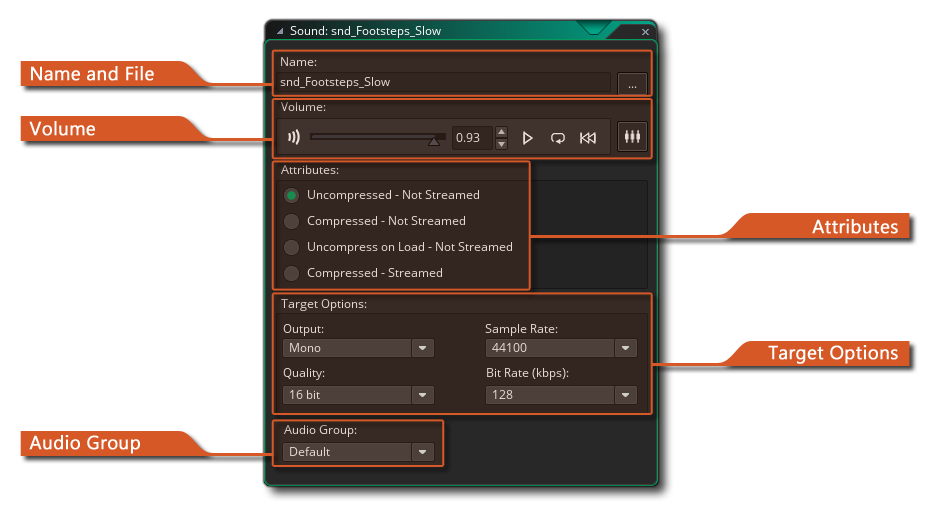

# The Sound Editor 声音编辑器

在“声音编辑器”中，您可以将声音加载到新的音频资源中并设置其属性。要加载声音，请按声音名称右侧的“加载声音”按钮。弹出一个文件选择器对话框，您可以在其中选择声音文件。这可以是WAV，MP3文件或OGG文件。通常，`*.wav`用于短的声音效果，尽管它们通常是较大的文件，但由于它们不需要任何类型的解码来播放，因此它们可以立即播放。`* .mp3`或`*.ogg`格式的文件应用于背景音乐或更大或更大型的声音效果。这些文件比wave文件小得多，但CPU开销很小，因为在播放之前必须对其进行解码。

加载文件后，您可以使用播放按钮预览声音，该按钮将连续播放声音。这非常方便，因为这意味着您可以使用窗口底部的滑块来更改音量，并聆听其对声音的影响。还有一个停止按钮，因此您可以随时停止预览。

声音窗口还具有其他选项，如下所述：

## Name And File

在这里您可以单击打开按钮以打开文件浏览器并选择要加载的音频文件。您也可以从左侧的“Name”字段中设置新资源的名称。名称只能是字母数字，并且只能使用下划线“ _”符号，并且不能以数字开头。

## Attributes 属性

本部分用于设置声音属性。这些是导出游戏时将设置的属性，并且将影响运行时声音的播放方式。对于声音效果（WAV格式），您需要对其进行解压缩，以便它们可以快速播放并且不需要解码，但是对于OGG和MP3，通常需要其他三个选项之一。

压缩的音频将强制将所有声音文件（无论它们是* .wav还是* .mp3或* .ogg）压缩为所有平台的Ogg Vorbis * .ogg格式文件。这些声音在光盘上较小，但由于需要在播放之前先解压缩并加载到内存中，因此会占用少量CPU资源，因此，如果要在已经占用大量CPU的游戏中使用压缩，则应牢记这一点。

您可以通过选择在负载上解压缩来稍微减轻此CPU开销，这会将所有声音放入设备内存中以加快播放速度，但以增加内存使用为代价。

 如果选择了压缩音频，则还可以选择从磁盘流式传输声音。流式声音将是未经压缩并实时播放的声音，它是从光盘流式传输而不是加载到内存中的。流媒体是音乐的理想选择，因为它减少了解压缩整个文件的一次性开销-这可能会导致游戏暂停-但不建议用于简单的声音效果（CPU受到的影响要小得多）。如果您选择流音频，则无法将声音分配给音频组，并且此选项将被禁用，因为流声音的打包方式与其他声音不同，并且您可以完全控制它们的加载时间，使用代码播放和卸载。

重要的是要注意，在定位HTML5平台时。当播放请求不是直接来自用户交互（即触摸事件等）时，流式音频将无法在iOS上播放。 但是，由于GameMaker Studio 2将点击事件排队，并且仅在下一帧处理它们，因此在没有浏览器阻止的情况下播放流音频是不可能的。为了解决这个问题，在iOS浏览器上运行的任何HTML5游戏都将在引擎中将所有流音频视为未流音频，但不预加载流音频。

这意味着如果您的游戏在iOS浏览器上运行，并且-例如-您有10条音乐曲目都设置为流mp3文件。所有10个信号都将像未流音频一样进行初始化，但不会在游戏加载之前立即对其进行解码，这与正常流音频不同，后者会在加载屏幕阶段立即进行预加载/解码。

尽管这绕过了iOS问题并阻止了初始加载时间的大幅增加，但这确实意味着它可能会导致游戏已加载的状态，但是某些流声音仍可能正在下载或解码。 为了解决这个问题，您可以使用GML函数audio_sound_is_playable（），该函数检查是否可以实际播放给定的声音。在HTML5上，如果声音尚未完全加载或解码，则返回false；如果可以播放，则返回true（在所有其他平台上，它将始终返回true）。

## Volume

 您可以在此处设置给定声音的播放音量。该值只是默认值，例如如果滑块在中间-例如-在游戏中使用时该声音的音量将为0.5。但是，如果您使用项目中的音频功能对增益进行任何更改，它将被覆盖。除了音量控制，还有回放控制，你可以预览声音，将其设置为循环或倒带。您也可以单击图标在混音器中打开声音.

## Target Options

在“目标选项”面板中，可以设置游戏的转换率。这些设置将影响向目标平台导出声音的方式，GameMaker Studio 2将自动为您转换声音文件-您只需控制转换后这些声音的最终质量即可。 通常，默认设置为16位质量（或位深度），44100kHz采样率和192kbps比特率就足够了，但是您可能希望声音效果（例如）质量较低，而音乐则质量较高，在这种情况下，可以更改这些设置。

您还可以选择转换是单声道，立体声还是3D。如果计划使用音频发射器功能来创建3D声音效果，则应在此处进行说明，否则请根据要使用声音的用途选择单声道或立体声。如果您选择将声音用于3D音频，则将其导出为单声道声音。

> *注意：声音的质量越高，文件越大，在决定选择哪种比特率和采样率时应考虑到这一点。*

## Audio Group

您可以将音频文件分配给特定的音频组。这些是从``音频组''窗口创建的，用于将音频资产分组在一起，以简化内存管理和音量控制。

将音频文件分配给一个组后，您便可以使用特定的音频组功能来更改它们，并从内存中加载/卸载它们。有关更多信息，请参见音频功能的参考部分。

如果您选择了流音频，则此选项将被禁用，因为流声音的打包方式与其他声音不同，不会被加载到内存中，而是直接从存储介质中流化。

请注意，尽管其余音频属性是特定于配置的，但是音频组设置不是，音频将在您使用的所有配置上属于同一组。

