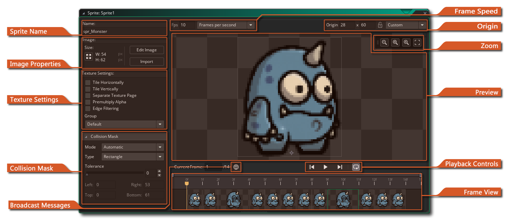
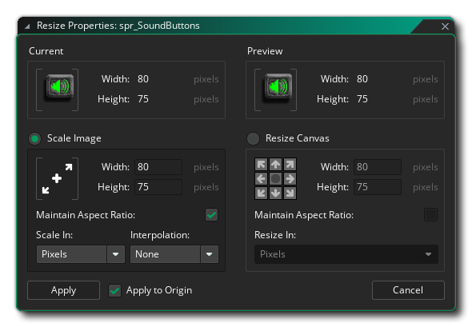
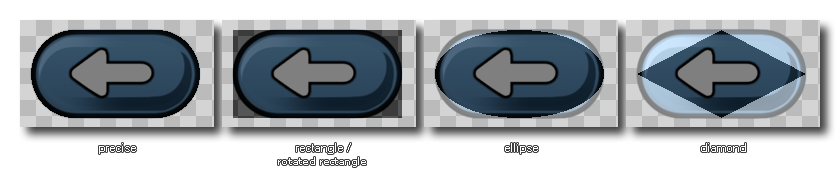
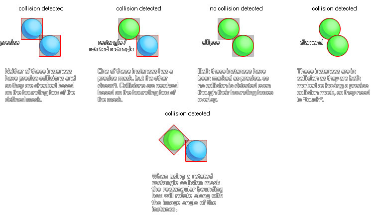
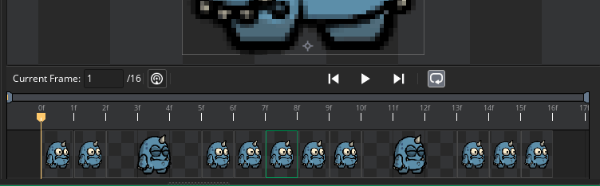
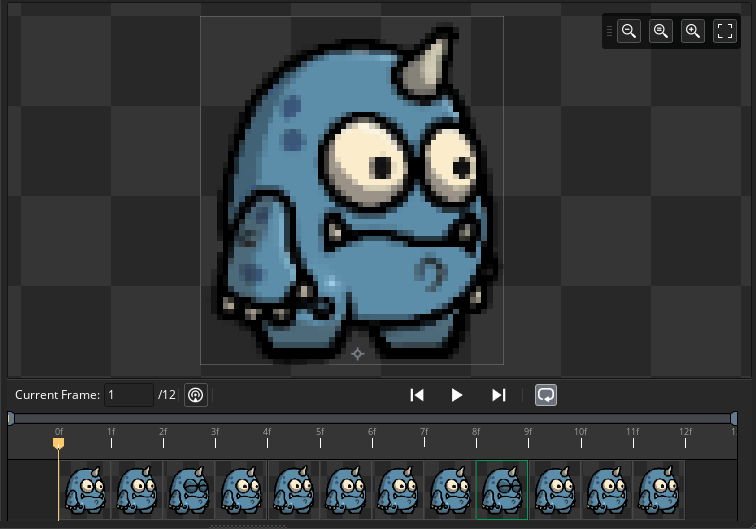
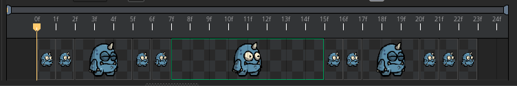

# The Sprite Editor 精灵编辑器

在Sprite Editor中，您可以设置自己制作的Sprite的常规属性。您可以通过以下方式打开此窗口：创建一个新的精灵（在资源浏览器上单击鼠标右键，然后选择Create Sprite），双击现有的精灵，或者右键单击现有的精灵并选择**Properties**。

组成Sprite Editor的部分如下：

## Sprite Name

在这里您可以命名精灵。精灵名称是整个游戏项目中用来将精灵标识为资源的名称，只能为字母数字，并且只能使用下划线'_'符号。尽管您可以在精灵名称中使用数字，但是名称不能以数字开头，因为使用GML或DnD™时，它将使其成为无效的资源名称。

## Image Properties

在本节中，您可以通过单击“**Sprite Size**”按钮设置图像大小。这将打开以下窗口：

在这里，您可以看到在应用选定的转换之前和之后的精灵预览，以下部分用于设置新的精灵属性，并分为两部分：

- **Scale Image**: 缩放图像：使用此选项，您可以调整精灵绘制画布的大小，并且精灵中包含的所有图像都会被拉伸和缩放以适应新的大小。您可以选择缩放并保持基本图像的长宽比，还可以选择以像素或百分比缩放。根据您使用的图像类型，您可能还希望启用或不启用线性插值（通常，线性插值将使区域上的像素“平滑”，因此最好不要使用像素图）。
- **Resize Canvas**:调整画布大小：此选项将在不缩放内容的情况下将绘图画布调整为新大小。您可以使用方向箭头设置调整大小的“锚点”，然后设置大小值。调整画布大小时，有一个选项可以保持纵横比，在底部，您可以选择以像素或百分比设置调整大小值。

对新大小满意后，可以单击“*Apply* ”以应用更改并关闭“调整大小”属性窗口。请注意，在将大小或大小的更改应用于子画面时，您可以选择将更改也应用于子画面的原点，方法是选中*Apply* 按钮旁边的**Apply to Origin**复选框。选中后-如果原点不是默认设置之一且未锁定在sprite中-则将缩放其位置以匹配更改与sprite的大小。如果未选中，则不会将缩放比例应用于原点。如果原点不是自定义值或已被锁定，则原点将变灰且不可用。您可以从“精灵编辑器首选项”为所有精灵设置此选项。

> *注意：此选项仅适用于位图精灵，而对于SWF或骨架动画精灵将显示为灰色。*

在此部分中，您也可以打开图像编辑器以绘制您的精灵，或者您可以单击``导入''按钮导入以前创建的精灵。可以从大多数常见的位图格式（PNG，JPG，GIF等）导入子画面，但GameMaker Studio 2还支持矢量子画面（SWF）和骨骼动画子画面（Spine）。有关这些格式的更多信息，请参见“非位图精灵”部分。请注意，在导入位图精灵时，您可以在文件资源管理器中选择多个图像文件，并且每个图像文件将作为单独的子图像（帧）添加到相同的精灵中。

## Texture Settings 纹理设置

Sprite属性窗口的这一部分介绍GameMaker Studio 2如何将组成您Sprite的图像存储在纹理页面上，以用于设备和浏览器。对于桌面平台，这可能不太重要，但是当您开始为移动设备或Web开发时，对图像资产（纹理）的正确管理就变得非常重要，因为管理不当的纹理可能会对游戏产生不利影响，从而导致性能问题。

默认情况下，通常不选中“水平平铺”和“垂直平铺”复选框，因为大多数情况下您不想平铺精灵。但是，在某些情况下，您可能希望它们平铺，这意味着您应该检查这些选项，尤其是在要缩放视图或房间的情况下，因为如果未生成纹理页面，则缩放会在游戏图形中引入伪影适当地。

如果您的精灵将在3D游戏中用作纹理贴图，则应选中“单独的纹理页面”框，然后将为精灵赋予一个单独的纹理页面（请注意，每个子图像也将获得其纹理页面）自己的纹理页面，因此，如果您的精灵有10张图像，您将生成10个纹理页面.这将增加游戏的纹理内存需求，因此在使用此选项时必须格外小心。还要注意，一般来说，如果您的精灵正在使用此选项进行3D渲染，则纹理应为2的幂（即：128x128、256x256、512x512等）。

下一个选项是为子画面图像启用**Pre-Multiplied Alpha** 。启用后，它将预乘精灵所有子图像的Alpha。通常，这仅是将sprite绘制到表面上或用于某些特定特殊效果的必要条件。对于普通精灵，您应该看不到普通精灵和预乘精灵之间的任何明显差异。

我们还有一个边缘过滤(**Edge Filtering** )选项。此选项特别适用于为游戏启用了线性插值并且在子画面周围看到颜色“晕”的情况。这是由于硬件同时从纹理页面上的多个源纹理插入而造成的，当您按分辨率放大游戏时，这一点尤其明显。启用此功能将对边缘像素进行滤波，以呈现最接近的完整Alpha Sprite像素的颜色，因此将插值的像素混合在一起，而不会出现以前存在的光晕。

最后，可以选择希望精灵资源所属的纹理组。 基本上，纹理组（以前在纹理组管理器中定义）是可以设置的，以便可以将特定房间或游戏级别所需的所有图像资源存储在一起。因此，例如，您可以将所有1级图像放在一个纹理组中，而所有2级图像放在另一个纹理组中，等等，而GameMaker Studio 2会尝试将所有这些分组的资源放在同一纹理页面上以减少纹理页面在所选目标平台上运行游戏时进行交换。

> *注意：这可能并非总是必要的，此方法的性能提高将取决于目标设备是CPU绑定还是GPU绑定。*

您可以在[here](https://manual-en.yoyogames.com/Settings/Texture_Information/Texture_Pages.htm)找到有关纹理页面的更多信息。

纹理组仅与位图图像相关，非位图精灵不会分配给纹理组，并且上述某些选项将不可用。一些非位图精灵已经具有自己独特的纹理页面（骨架动画精灵），而其他一些则不需要纹理，因为它们由矢量组成（SWF精灵）。有关更多信息，请参见以下部分：

- [Non-Bitmap Sprites](https://manual-en.yoyogames.com/Settings/Texture_Information/Non-Bitmap_Sprites.htm)

## Collision Mask 碰撞遮罩

所有的精灵都有一个碰撞蒙版，它对应于将精灵分配给实例时将用于检测冲突的精灵区域。您可以首先设置防撞蒙版的模式，该模式可以是以下之一：

- **Automatic**:  自动：GameMaker Studio 2将根据子画面的Alpha值自动计算碰撞蒙版（这取决于下面介绍的“容差”设置）。
- **Full Image**: 完整图像：将根据蒙版的左边界，右边界，上边界和下边界来计算蒙版。
- **Manual**: 手动：选择此选项表示您希望使用左，右，顶部和底部的输入值来设置碰撞蒙版的边界。

除了“碰撞蒙版”模式外，还可以从下拉菜单中选择各种类型的碰撞蒙版：

- **Rectangle**: 矩形：一个简单的矩形碰撞防护罩。在项目中使用时，这是最快的解决方法。
- **Rotated Rectangle**: 旋转矩形：这是一个简单的矩形碰撞蒙版，它将与分配了Sprite的实例的image_angle值一起旋转。它比常规的矩形防碰撞罩要慢解决，但比精确的防碰撞罩要快。
- **Ellipse**: 椭圆：创建椭圆碰撞蒙版。这比矩形蒙版的解析速度慢。
- **Diamond**: 钻石：创建一个“钻石”碰撞蒙版。与矩形和椭圆形蒙版相比，这解决起来较慢，并且会产生更多的CPU开销。
- **Precise**:精确：这会根据精灵的轮廓创建精确的碰撞蒙版。如果子画面具有多个子图像，则这将是彼此重叠的所有子图像的边缘的合成。请注意，如果将“模式”设置为“手动”并更改默认值，则精确蒙版将被剪切到边界框。这非常慢，并且会产生大量CPU开销。
- **Precise (per frame)**:精确（每帧）：这会在每帧的基础上创建一个精确的碰撞蒙版（即：该蒙版将更改为与每个不同帧的轮廓一致）。请注意，如果将“模式”设置为“手动”并更改默认值，则精确蒙版将被剪切到边界框。这是迄今为止解决的最慢的碰撞防护类型，除非在非常非常特殊的情况下以及很少的情况下，否则应避免这种情况。

下图说明了不同的遮罩选项：

碰撞检查选项对于您的游戏而言非常重要，因为它们将直接影响对象的交互方式和游戏的运行方式，错误的设置甚至会对整体性能产生负面影响。这是为什么？好吧，每当两个实例相遇且两个实例都具有有效的蒙版时，就会通过检查边界框和蒙版的重叠来生成碰撞事件，这可能是精确的，也可能不是精确的，并且是否适合图像索引。下图说明了这一点：

在“碰撞蒙版”设置下，您具有“ alpha公差”滑块，该滑块指示相对于精灵像素的透明度创建蒙版的公差-具有较高部分透明度的像素保留在蒙版之外，而具有较低透明度的部分则保留在蒙版之外。遮罩的公差将考虑这些像素。这会影响边界框（未设置为手动时）和用于精确碰撞检查的蒙版。

最后，您可以设置蒙版的边界框限制。边界框是精灵蒙版所适合的矩形区域的名称。仅将此边界框内的像素用于遮罩，并且会参与碰撞检查，并且默认情况下会自动计算出该像素，同时考虑到alpha公差。如果您选中了“精确度（每帧）”，那么对于每个子图像，这也将是单独的。自行设置时，可以在左侧，右侧顶部和底部的框中输入值，也可以在Sprite预览窗口中单击并拖动以在Sprite上``绘制''它。请注意，在“绘制”边界框时，会自动生成遮罩以适合最终值，并且边界框可以“剪切”遮罩。

值得注意的是，如果转到“预览”窗口，则可以使用每个角上的“手柄”来调整碰撞蒙版。单击并拖动它们将调整碰撞蒙版，与为边界框输入值相同。

## Broadcast Messages

此按钮会将广播消息添加到Sprite时间轴，打开一个对话框，您可以在其中添加要广播的消息。该消息将添加到播放头在帧视图中的任何位置，并且由一个简单的字符串组成，可以在触发该消息并对其进行操作后在``广播消息事件''中进行选择。

添加后，该消息将显示在``框架视图''中，您可以在其上单击鼠标右键以打开菜单，您可以在其中删除或编辑该消息。有关广播消息的更多信息，请参见[here](https://manual-en.yoyogames.com/The_Asset_Editors/Sequence_Properties/Broadcast_Messages.htm).

## Frame Speed

在此部分中，您可以从左侧的输入框中设置动画帧的播放速度。帧速度设置可以基于“每秒帧数”或“每个游戏帧数”，其中30个“每秒帧数”的设置将在一秒钟内显示30帧动画，而30帧设置“每游戏帧的帧数”会尝试在单个游戏步骤中显示所有30帧，因此“每游戏帧的帧数”值通常设置为1或更低（例如：每游戏帧的帧数为0.5时，每隔一帧就会显示一个新帧两个游戏步骤）。

重要的是要注意，“帧速度”设置不仅会影响预览窗口中动画的播放，而且还会控制游戏中精灵的动画设置。 您在此处设置的速度将显示精灵预览，因为它将在游戏中以1的图像速度乘数运行。但是可以使用image_speed变量在代码中进行设置，这意味着精灵可以根据编程的内容更快或更慢地运行。因此，例如，如果您将精灵设置为使用10个“每秒帧数”，然后将image_speed设置为0.5，则游戏将以一半速度绘制精灵，即每秒绘制5帧。相反，如果我们将相同子画面的image_speed设置为2，则在游戏中它将以两倍的速度绘制动画-每秒20帧。请注意，也可以在图像编辑器中设置帧速。

## Sprite Origin 精灵原点

Sprite编辑器的顶部栏包含Sprite原点属性。这是精灵上与其在房间中的位置相对应的点，即：当您在特定的x / y位置创建实例时，精灵的原点放置在该位置。

默认情况下，原点是精灵的左上角，但是使用中间中心通常更方便，或者您可能希望使用其他位置（例如对于平台游戏角色，您可能需要底部居中），因此您可以在原点下拉菜单上单击并选择默认值之一。您也可以通过以下方式手动设置原点：在Sprite预览图像中单击，这会将原点标记移至您单击的点，或者在相应的框中输入x和y的不同值。请注意，您甚至可以通过使用负数（大于或等于小精灵的宽度和高度，如右和向下）设置负数（用于小数位数的左侧和上方），或者在小精灵区域之外设置原点，这在处理带有需要绘制复合精灵。

## Zoom Controls 缩放控制

在“预览”窗口的右上角，具有缩放控件。这些按钮控制当前的预览精灵缩放级别。 您可以放大或缩小，单击将在编辑精灵时将预览重置为1：1。您还可以单击窗口适合按钮，以使整个精灵预览适合当前编辑器窗口（这将适当放大/缩小以使其适合）。请注意，您可以使用 / 和鼠标滚轮进行放大和缩小，然后按 /  + 将预览与精算精灵大小设置为1：1。

## Preview 预览

Sprite预览窗口显示了游戏中将显示的Sprite，可以使用鼠标滚轮进行放大或缩小，也可以使用鼠标中键进行平移和拖动，或者使用  + 组合拖动。您也可以使用“框”控件（如下所述）来更改预览图像的显示方式。

此窗口还将显示一个标记十字形原点的十字''（有关更多详细信息，请参见上面的十字形原点''部分），并且如果正在编辑该选项，则还可以显示碰撞蒙版''（请参见上方的碰撞蒙版''部分） ）。

## Playback Controls 播放控制

播放控件用于在预览窗口中播放帧的动画，其中使用播放按钮开始/停止动画和循环按钮来设置子画面是否循环播放（到达最后一帧时返回到第一帧）或乒乓球（到达最后一帧时向后浏览帧）。

请注意，loop / ping-pong选项不会影响精灵在游戏中的显示方式，因此在精灵中设置这些选项不会更改游戏在编译和运行时的显示方式。对于可以在``帧视图''中设置的循环点（请参见下文了解更多信息），这也是正确的-这些循环点在sprite编辑器中完全可见，旨在帮助您测试动画，但不会影响动画的效果。 Sprite动画会显示在您的游戏中。

帧控件的另一部分是当前帧显示，并在左侧输入一点。该框显示了精灵动画的总帧数以及正在显示的当前帧。您可以随时单击输入框并输入要查看的帧号来更改当前帧。

> 重要的！显示的帧数从1到最大帧号，但是在您的游戏代码中，帧数从0到最大帧号-1。

## Frames

 Sprite编辑器的这一部分显示了沿序列时间轴组成单个Sprite集合的每个不同帧。 您可以在任何框架上单击并向左或向右拖动以更改它们的动画显示顺序，也可以在任何框架上双击以启动图像编辑器并进行编辑。您可以使用标准键盘快捷键或鼠标右键菜单选项来剪切，复制和粘贴框架，还可以使用 /  + 选择多个框架进行操作。

鼠标右键菜单具有以下选项：

- **Add Frame** -  添加帧-在动画的最后添加一个新帧。
- **Insert Frame** - 插入帧-在当前选定帧之后的动画中插入新帧。
- **Cut** / **Copy** / **Paste** - 剪切/复制/粘贴-剪切，复制和粘贴一帧或多帧。
- **Delete Selected Frames** - 删除选定的帧-删除当前选定的一个或多个帧。

除了上面给出的拉伸框架的选项之外，您还可以将鼠标放在框架的边缘，然后当光标变为双箭头时，只需单击并拖动以调整框架的大小，则需要更多时间：

拉伸的帧将需要更多的时间显示，就像您多次复制同一帧一样。

最后，您还可以使用帧视图两侧的“句柄”来放大帧时间轴，如下图所示：

