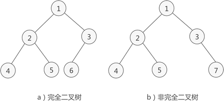

## 树的结点

叶子结点：如果结点没有任何子结点，那么此结点称为叶子结点。

## 结点的度和层次

对于一个结点，拥有的子树数（节点有多少分支）称为结点的**度**。

结点的层次：一棵树的深度（高度）是树中结点所在的最大层次。

## 有序树和无序树

如果树中结点的子树从左到右看，谁在左边，谁在右边，是有规定的，这棵树称为`有序树`，反之称为`无序树`。

> 在有序树中，一个结点最左边的子树称为 **第一个孩子**，最右边的称为 **最后一个孩子**。

## 森林

由 m（m>=0）个互不相交的树组成的集合被称为森林。

## 二叉树

满足两个条件的树就是二叉树：

- 本身是有序树
- 树中包含的各个节点的度不能超过2，即只能是0、1或者2.

## 二叉树的性质

1. 二叉树中，第i层最多有$2^{i-1}$
2. 深度为k的满二叉树必有$2^k-1$个节点，叶子数为$2^{k-1}$
3. 满二叉树中不存在度为1的节点，每一个分支点中都有两棵深度相同的子树，且叶子节点都在最底层。
4. 具有n个节点的满二叉树的深度为${log_{2}}^{n+1}$

## 完全二叉树

如果二叉树中除去最后一层节点为满二叉树，且最后一层的结点依次从左到右分布，则此二叉树被称为完全二叉树。

完全二叉树除了具有普通二叉树的性质，它自身也具有一些独特的性质，比如说，n 个结点的完全二叉树的深度为 $\left \lfloor {log_{2}}^{n} \right \rfloor$+1

> $\left \lfloor {log_{2}}^{n} \right \rfloor$ 表示取小于 ${log_{2}}^{n}$ 的最大整数。例如，$\left \lfloor {log_{2}}^{4} \right \rfloor$ = 2，而 $\left \lfloor {log_{2}}^{5} \right \rfloor$ 结果也是 2。 向下取整。

对于任意一个完全二叉树来说，如果将含有的结点按照层次从左到右依次标号（如图 3a)），对于任意一个结点 i ，完全二叉树还有以下几个结论成立：

1. 当 i>1 时，父亲结点为结点 [i/2] 。（i=1 时，表示的是根结点，无父亲结点）
2. 如果 2*i>n（总结点的个数） ，则结点 i 肯定没有左孩子（为叶子结点）；否则其左孩子是结点 2*i 。
3. 如果 2*i+1>n ，则结点 i 肯定没有右孩子；否则右孩子是结点 2*i+1 。
 
