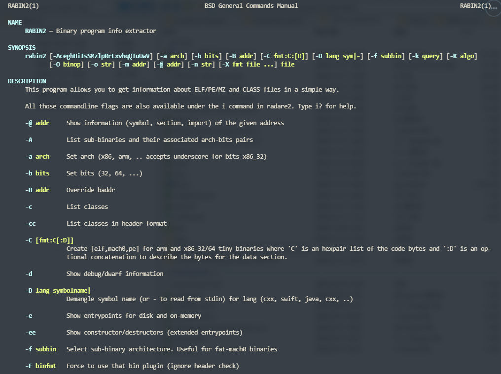
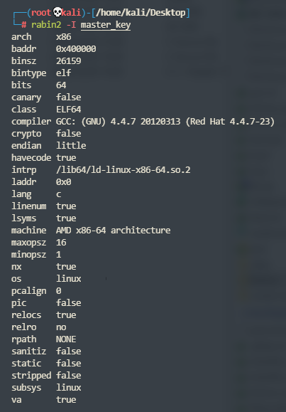
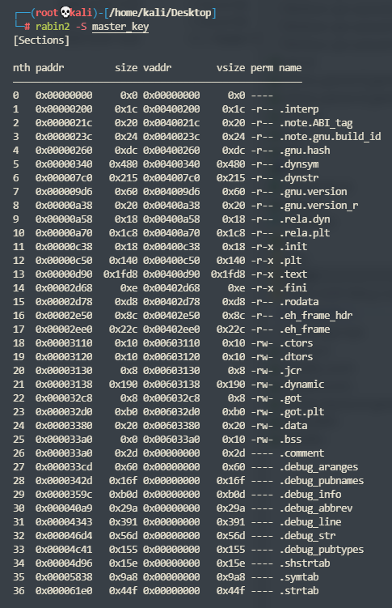

# Radare2

官方文档： [Introduction - The Official Radare2 Book](https://book.rada.re/index.html)


说起逆向，你想到的可能是IDA Pro，OllyDBG。

而Radare*2*是一款开放源代码的逆向工程平台，它的强大超越你的想象，包括反汇编、分析数据、打补丁、比较数据、搜索、替换、虚拟化等等，同时具备超强的脚本加载能力，并且可以运行在几乎所有主流的平台（GNU/Linux, .Windows *BSD, iOS, OSX, Solaris…）上。可谓是一大神器。


## rabin2

radare2里面有个很牛逼的工具：rabin2

 rabin2 可以获取包括ELF, PE, Mach-O, Java CLASS文件的区段、头信息、导入导出表、字符串相关、入口点等等，并且支持几种格式的输出文件。使用man rabin2 可以查看rabin2的使用帮助文档。

```shell
man rabin2
```








显示section

```shell
rabin2 -S bin
```


