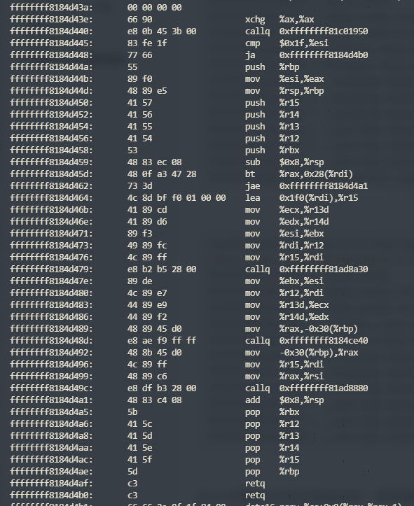

# Linux内核之vmlinuz反汇编


## 1.安装kernel-devel包


1. Ubuntu中安装kernel-devel

　　kernel-devel is a RedHat and derivatives package. In Ubuntu you may need to install the linux-kernel-headers and kernel-package. Try the following command in Terminal:

```shell
sudo apt-get install linux-kernel-headers kernel-package
```


2. RedHat系

```shell
sudo yum install kernel-devel
```


## 2.提取vmlinux

- vmlinux是一个包括Linux kernel的静态链接的可运行文件。
- vmlinuz是vmlinux经过gzip和objcopy制作出来的压缩文件。

1. RedHat系

```shell
/usr/src/kernels/$(uname -r)/scripts/extract-vmlinux /boot/vmlinuz-$(uname -r) > vmlinux
```

2. debian系

```shell
/usr/src/$(uname -r)/scripts/extract-vmlinux /boot/vmlinuz-$(uname -r) > vmlinux
```


## 3.反汇编vmlinux

```shell
objdump -D vmlinux > vmlinux.out
```


## 4.查看vmlinux里的函数

这里以函数tcp4_proc_init为例。/proc/kallsyms存储了所有的内核符号表，/boot/System.map则存储了静态的内核符号表。有关System.map，请阅读[这里](https://rlworkman.net/system.map/)。

```shell
root@superman-PC:/usr/src/linux-headers-5.4.50-amd64-desktop# grep input_event /proc/kallsyms 
ffffffffa124d440 T input_event
ffffffffa124d720 T input_event_from_user
ffffffffa124d7e0 T input_event_to_user
ffffffffa12ea130 t hidinput_input_event
ffffffffa12ef2f5 t hidinput_input_event.cold.24
ffffffffa1e922c0 r __ksymtab_input_event
ffffffffa1ea345c r __ksymtab_input_event_from_user
ffffffffa1ea3468 r __ksymtab_input_event_to_user
ffffffffa1ed31e1 r __kstrtab_input_event
ffffffffa1ed3207 r __kstrtab_input_event_to_user
ffffffffa1ed321b r __kstrtab_input_event_from_user
ffffffffc0636000 t snd_rawmidi_input_event_work [snd_rawmidi]
```


```shell
root@superman-PC:/usr/src/linux-headers-5.4.50-amd64-desktop# grep input_event /boot/System.map-5.4.50-amd64-desktop 
ffffffff8184d440 T input_event
ffffffff8184d720 T input_event_from_user
ffffffff8184d7e0 T input_event_to_user
ffffffff818ea130 t hidinput_input_event
ffffffff818ef2f5 t hidinput_input_event.cold.24
ffffffff824922c0 r __ksymtab_input_event
ffffffff824a345c r __ksymtab_input_event_from_user
ffffffff824a3468 r __ksymtab_input_event_to_user
ffffffff824d31e1 r __kstrtab_input_event
ffffffff824d3207 r __kstrtab_input_event_to_user
ffffffff824d321b r __kstrtab_input_event_from_user
```


在vim中查找`ffffffff8184d440`，找到函数汇编

