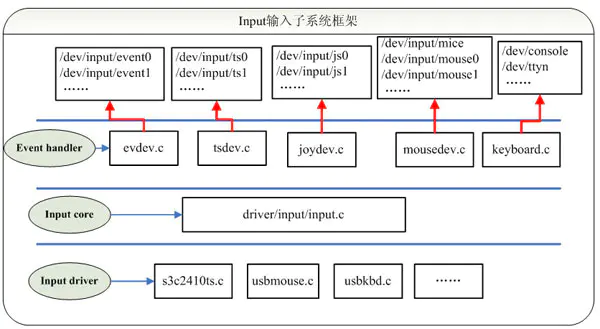
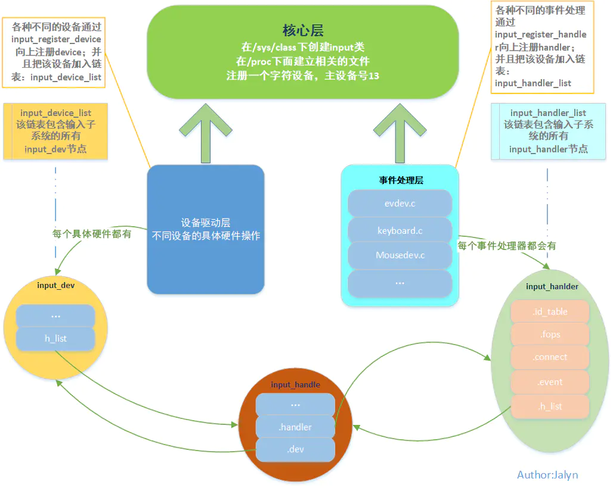

# Linux输入子系统框架

## 输入子系统概述

Linux内核为了能够处理各种不同类型的输入设备，比如 触摸屏 ，鼠标 , 键盘 , 操纵杆 ，设计并实现了为驱动层程序的实现提供统一接口函数；为上层应用提供试图统一的抽象层 , 即是Linux 输入子系统 。



从上图输入子系统的框架图，可以看出，输入子系统由Input driver（驱动层）、Input core（输入子系统核心）、Event handler（事件处理层）三部分组成。一个输入事件，如鼠标移动、键盘按下等通过Input driver -> Input core -> Event handler -> userspace的顺序到达用户空间的应用程序。


- Input driver ：主要实现对硬件设备的读写访问，中断设置，并把硬件产生的事件转换为核心层定义的规范提交给事件处理层。

- Input core ：承上启下。为设备驱动层提供了规范和接口；通知事件处理层对事件进行处理；

- Event handler ：提供用户编程的接口（设备节点），并处理驱动层提交的数据处理。


## 输入子系统框架分析

输入子系统是所有I/O设备驱动的中间层，为上层提供了一个统一的界面。例如，在终端系统中，我们不需要去管有多少个键盘，多少个鼠标。它只要从输入子系统中去取对应的事件(按键，鼠标移位等)就可以了。

上面，我们从功能级别，描述了输入子系统每一层，做了些什么。接下来，我们将从代码级别的角度出发，分析系统核心层、事件处理层、设备驱动层。

### 1.系统核心层（Input core）

- 申请主设备号;
- 提供input_register_device跟input_register_handler函数分别用于注册device跟handler;
- 提供input_register_handle函数用于注册一个事件处理，代表一个成功配对的input_dev和input_handler;

### 2.事件处理层（Event handler）

- 不涉及硬件方面的具体操作，handler层是纯软件层，包含不同的解决方案，如键盘，鼠标，游戏手柄等；
- 对于不同的解决方案，都包含一个名为input_handler的结构体，该结构体内含的主要成员如下：

| **成员**    | **功能**                                                     |
| ----------- | ------------------------------------------------------------ |
| .id_table   | 一个存放该handler所支持的设备id的表（其实内部存放的是EV_xxx事件,用于判断device是否支持该事件） |
| .fops       | 该handler的file_operation                                    |
| .connect    | 连接该handler跟所支持device的函数                            |
| .disconnect | 断开该连接                                                   |
| .event      | 事件处理函数，让device调用                                   |
| h_list      | 是一个链表，该链表保存着该handler到所支持的所有device的中间站：handle结构体的指针 |

### 3.设备驱动层（Input driver）

- device是纯硬件操作层，包含不同的硬件接口处理，如gpio等
- 对于每种不同的具体硬件操作，都对应着不同的input_dev结构体
- 该结构体内部也包含着一个h_list，指向handle

### 4.两条链表一个结构

- 对于handler和device，分别用链表input_handler_list和input_device_list进行维护，当handler或者device增加或减少的时候，分别往这两链表增加或删除节点，这两条都是全局链表。

- input_handle 结构体代表一个成功配对的input_dev和input_handler。input_hande 没有一个全局的链表，它注册的时候将自己分别挂在了input_device_list和 input_handler_list的h_list上了；同时，input_handle的成员`.*dev`，关联到input_dev结构，`.*handler`关联到input_handler结构 。从此，建立好了三者的铁三角关系，通过任何一方，都可以找到彼此

  



总结一下，输入子系统作为一个模块存在；向上,为用户层提供调用接口；向下,为驱动层程序提供统一的注册接口。这样,就能够使输入设备的事件通过输入子系统发送给用户层应用程序,用户层应用程序也可以通过输入子系统通知驱动程序完成某项功能。(Linux中在用户空间将所有的设备都当初文件来处理，由于在一般的驱动程序中都有提供fops接口，以及在/dev下生成相应的设备文件nod，这些操作在输入子系统中由事件处理层完成）


## 输入子系统分析

Input core 作为输入子系统的核心，我们以他为入口，进行分析。内核所有的输入子系统核心代码在`driver/input`下；
driver/input/input.c （核心层）
找到入口函数：

```c
subsys_initcall(input_init); 
```

`input_init`：分析：

```c
static int __init input_init(void)
{
    int err;

    err = class_register(&input_class); //在/sys/class下创建逻辑（input）类
    if (err) {
        pr_err("unable to register input_dev class\n");
        return err;
    }

    err = input_proc_init();//在/proc下面建立相关的文件
    if (err)
        goto fail1;
        
    /*申请一个字符设备，主设备号13*/
    err = register_chrdev_region(MKDEV(INPUT_MAJOR, 0),
                     INPUT_MAX_CHAR_DEVICES, "input");
    if (err) {
        pr_err("unable to register char major %d", INPUT_MAJOR);
        goto fail2;
    }

    return 0;

 fail2: input_proc_exit();
 fail1: class_unregister(&input_class);
    return err;
}
```


在入口函数里面创建了一个input_class类,其实就在/sys/class下创建了一个目录input。

另外在/proc创建了入口项,这样就可以/proc目录看到input的信息.

然后就注册设备,可以看出输入子系统的主设备号是13,在这里并没有生成设备文件.只是在/dev/目录下创建了input目录,以后所有注册进系统的输入设备文件都放在这个目录下。

到这里，输入子系统的核心初始化也就完成了，完成了？你可能会有这样的疑问：

①为什么这里代码只创建逻辑(input)类，没有使用class_device_create()函数在类下面注册驱动设备？

②为什么这里的代码只是申请了一个主设备号INPUT_MAJOR的字符设备，没有进行设备的注册？

核心层作为一个中转层存在，不涉及具体硬件设备的注册，倒是更符合他存在的逻辑。那么猜测下，设备的注册到底会在Input driver 还是Event hanlder呢？往下分析...

### **输入核心为驱动层提供统一的接口，涉及的结构和方法如下：**

实现设备驱动核心工作是：向系统报告按键、触摸屏等输入事件（event，通过input_event结构描述），不再需要关心文件操作接口。驱动报告事件经过inputCore和Eventhandler到达用户空间。

#### input_dev结构

```c
   struct input_dev {  
        const char *name;  //提供给用户的输入设备的名称  
        const char *phys;  //提供给编程者的设备节点的名称  
        const char *uniq;  //指定唯一的ID号，就像MAC地址一样
        struct input_id id;  //输入设备标识ID，用于和事件处理层进行匹配
        unsigned long evbit[NBITS(EV_MAX)];   // 记录设备支持的事件类型 
        unsigned long keybit[NBITS(KEY_MAX)]; // 记录设备支持的按键类型   
        unsigned long relbit[NBITS(REL_MAX)]; // 表示能产生哪些相对位移事件, x,y,滚轮  
        unsigned long absbit[NBITS(ABS_MAX)]; // 表示能产生哪些绝对位移事件, x,y  
        unsigned long mscbit[BITS_TO_LONGS(MSC_CNT)];  
        unsigned long ledbit[BITS_TO_LONGS(LED_CNT)];  
        unsigned long sndbit[BITS_TO_LONGS(SND_CNT)];  
        unsigned long ffbit[BITS_TO_LONGS(FF_CNT)];  
        unsigned long swbit[BITS_TO_LONGS(SW_CNT)];
        unsigned int hint_events_per_packet;
        unsigned int keycodemax;
        unsigned int keycodesize;
        void *keycode;
        ...  
   }
```

| **功能**           | **接口**                                                     |
| ------------------ | ------------------------------------------------------------ |
| 分配输入设备函数   | struct input_dev *input_allocate_device(void)                |
| 注册输入设备函数   | int input_register_device(struct input_dev *dev)             |
| 注销输入设备函数   | void input_unregister_device(struct input_dev *dev)          |
| 事件支持（初始化） | set_bit() <br/>告诉input输入子系统支持哪些事件，哪些按键，<br/>例如： <br/>set_bit(EV_KEY,button_dev.evbit)<br/>(其中button_dev是struct input_dev类型) <br/>struct input_dev中有两个成员为： <br/>evbit: 事件类型（EV_RST,EV_REL,EV_MSC,EV_KEY,EV_ABS,EV_REP等） <br/>keybit: 按键类型（当事件类型为EV_KEY时包括BTN_LEFT,BTN_0,BTN_1,BTN_MIDDLE等） |
| 报告事件           | void input_event(struct input_dev *dev, unsigned int type, unsigned int code, int value) 在发生输入事件时，向子系统报告事件。<br/>参数说明： <br/>input_dev *dev :要上报哪个input_dev驱动设备的事件； <br/>type : 要上报哪类事件, 比如按键事件,则填入: EV_KEY； <br/>code: 对应的事件里支持的哪个变量，比如按下按键L则填入: KEY_L； <br/>value:对应的变量里的数值,比如松开按键则填入1,松开按键则填入0； |
| 报告结束           | input_sync()同步用于告诉input core子系统报告结束             |

所以，对于Input driver的工作主要还是分配、设置、注册一个结构体。`input_register_device()`用于注册一个输入设备。那么注册过程是怎样的呢？这是一个重点，在下面的代码中进行注释分析:

```c
int input_register_device(struct input_dev *dev)
{
    struct input_devres *devres = NULL;
    /* 输入事件的处理接口指针，用于和设备的事件类型进行匹配 */  
    struct input_handler *handler;
    unsigned int packet_size;
    const char *path;
    int error;

    if (dev->devres_managed) {
        devres = devres_alloc(devm_input_device_unregister,
                      sizeof(struct input_devres), GFP_KERNEL);
        if (!devres)
            return -ENOMEM;

        devres->input = dev;
    }

    /* 默认所有的输入设备都支持EV_SYN同步事件 */ 
    /* Every input device generates EV_SYN/SYN_REPORT events. */
    __set_bit(EV_SYN, dev->evbit);

    /* KEY_RESERVED is not supposed to be transmitted to userspace. */
    __clear_bit(KEY_RESERVED, dev->keybit);

    /* Make sure that bitmasks not mentioned in dev->evbit are clean. */
    input_cleanse_bitmasks(dev);

    packet_size = input_estimate_events_per_packet(dev);
    if (dev->hint_events_per_packet < packet_size)
        dev->hint_events_per_packet = packet_size;

    dev->max_vals = dev->hint_events_per_packet + 2;
    dev->vals = kcalloc(dev->max_vals, sizeof(*dev->vals), GFP_KERNEL);
    if (!dev->vals) {
        error = -ENOMEM;
        goto err_devres_free;
    }

    /*
     * If delay and period are pre-set by the driver, then autorepeating
     * is handled by the driver itself and we don't do it in input.c.
     */
    if (!dev->rep[REP_DELAY] && !dev->rep[REP_PERIOD]) {
        dev->timer.data = (long) dev;
        dev->timer.function = input_repeat_key;
        dev->rep[REP_DELAY] = 250;
        dev->rep[REP_PERIOD] = 33;
    }

    /*没有定义设备的getkeycode函数，则使用默认的获取键值函数*/
    if (!dev->getkeycode)
        dev->getkeycode = input_default_getkeycode;

    /*没有定义设备的setkeycode函数，则使用默认的设定键值函数*/
    if (!dev->setkeycode)
        dev->setkeycode = input_default_setkeycode;
    
    /*添加设备*/
    error = device_add(&dev->dev);
    if (error)
        goto err_free_vals;

    /* 获取并打印设备的绝对路径名称 */  
    path = kobject_get_path(&dev->dev.kobj, GFP_KERNEL);
    pr_info("%s as %s\n",
        dev->name ? dev->name : "Unspecified device",
        path ? path : "N/A");
    kfree(path);

    error = mutex_lock_interruptible(&input_mutex);
    if (error)
        goto err_device_del;

    /* `重要`:把设备挂到全局的input子系统设备链表input_dev_list上 */  
    list_add_tail(&dev->node, &input_dev_list);

    /* 核心重点，input设备在增加到input_dev_list链表上之后，会查找 
    * input_handler_list事件处理链表上的handler进行匹配，这里的匹配 
    * 方式与设备模型的device和driver匹配过程很相似，所有的input devicel
    * 都挂在input_dev_list上，所有类型的事件都挂在input_handler_list 
    * 上，进行“匹配相亲”*/  
    list_for_each_entry(handler, &input_handler_list, node)
        input_attach_handler(dev, handler);/*遍历input_handler_list，试图与每一个handler进行匹配*/

    input_wakeup_procfs_readers();

    mutex_unlock(&input_mutex);

    if (dev->devres_managed) {
        dev_dbg(dev->dev.parent, "%s: registering %s with devres.\n",
            __func__, dev_name(&dev->dev));
        devres_add(dev->dev.parent, devres);
    }
    return 0;

err_device_del:
    device_del(&dev->dev);
err_free_vals:
    kfree(dev->vals);
    dev->vals = NULL;
err_devres_free:
    devres_free(devres);
    return error;
}
```


上面的代码主要的功能有以下几个功能，也是设备驱动注册为输入设备委托内核做的事情：

- 添加设备；
- 把输入设备挂到输入设备链表`input_dev_list`中；
- 遍历`input_handler_list`链表，查找并匹配输入设备对应的事件处理层，如果匹配上了，就调用`handler`的`connnect`函数进行连接。设备就是在此时注册的，下面分析handler就清晰了。
   （input_attach_handler放到分析handler时再做讲解，更容易理解。）

### 输入核心为事件管理层提供主要接口：

事件处理层文件主要是用来支持输入设备并与用户空间交互，这部分代码一般不需要我们自己去编写，因为Linux内核已经自带有一些事件处理器，可以支持大部分输入设备，比如Evdev.c、mousedev.c、joydev.c等。

| 功能                     | 接口                   |
| :----------------------- | :--------------------- |
| 注册一个事件处理器       | input_register_handler |
| 向内核注册一个handle结构 | input_register_handle  |

对于Event handler，就是根据事件注册一个handler，将handler挂到链表input_handler_list下，然后遍历input_dev_list链表,查找并匹配输入设备对应的事件处理层，如果匹配上了，就调用`connect`函数进行连接，并创建input_handle结构。

下面以Evdev为例，来分析事件处理层。
vim drivers/input/evdev.c
同样找到入口函数：

```c
module_init(evdev_init);
```

`evdev_init`分析：

```c
static int __init evdev_init(void)
{
    return input_register_handler(&evdev_handler);
}
```

直接调用input_register_handler 注册一个input_handler结构体，这下回到了输入核心层提供的接口input_register_handler上，接着往下看：

```c
int input_register_handler(struct input_handler *handler)
{
    struct input_dev *dev;
    int error;

    error = mutex_lock_interruptible(&input_mutex);
    if (error)
        return error;

    INIT_LIST_HEAD(&handler->h_list);

    /* `重要`:把设备处理器挂到全局的input子系统设备链表input_handler_list上 */  
    list_add_tail(&handler->node, &input_handler_list);

    /*遍历input_dev_list，试图与每一个input_dev进行匹配*/
    list_for_each_entry(dev, &input_dev_list, node)
        input_attach_handler(dev, handler);

    input_wakeup_procfs_readers();

    mutex_unlock(&input_mutex);
    return 0;
}
```

这个input_register_handler的注册过程，你可以能看起来觉得挺熟悉；没错，这个注册过程和input_register_device极其相似；下面就重点分析匹配连接过程中，事件处理层到底做了些什么。
`input_attach_handler`匹配过程如下：

```c
static int input_attach_handler(struct input_dev *dev, struct input_handler *handler)
{
    const struct input_device_id *id;
    int error;

    /* 利用handler->id_table和dev进行匹配*/
    id = input_match_device(handler, dev);
    if (!id)
        return -ENODEV;
      /*匹配成功，则调用handler->connect函数进行连接*/
    error = handler->connect(handler, dev, id);
    if (error && error != -ENODEV)
        pr_err("failed to attach handler %s to device %s, error: %d\n",
               handler->name, kobject_name(&dev->dev.kobj), error);

    return error;
}
```

对于connect函数，每种事件处理器的实现都有差异，但原理都相同。他主要注册input_handle结构，然后将input_device和input_handler进行关联。