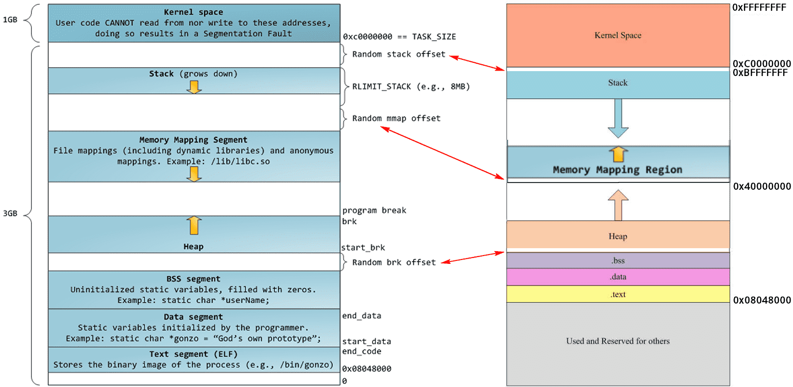

# 内存管理

内核把物理页作为内存管理的基本单位。


内存管理单元 MMU


MMU以页(page)大小为单位来和粳系统中的页表


在 32 操作系统中，其虚拟地址为 32 位长度，因此其虚拟地址空间的范围为 `2 ^ 32 = 4GB`。<font color='red'>Linux 系统将地址空间按 3:1 比例划分，其中用户空间（user space）占 3GB，内核空间（kernel space）占 1GB</font>。Linux 系统进程的虚拟内存地址空间布局如下图所示：





## 区

内核使用区对具有相似特性的页进行分组

Linux必须处理如下两种由于硬件存在缺陷而引起的内存寻址问题：

- 一些硬件只能用某些特定的内存地址来执行DMA (直接内存访问)
- 一些体系结构的内存的物理寻址警署比虎势寻址范围大得多。这样，就有一些内存不能永久地映射到内核空间上


因为存在这些制约条件，Linux主要使用了四种区：

- ZONE_DMA	—— 这个区包含的页能用来执行DMA操作
- ZONE_DMA32 —— 和ZONE_DMA类似，该区包含的页面可用来执行DMA操作；而和ZONE_DMA不同之处在于，这些页面<font color='red'>只能被32位设备访问</font>。
- ZONE_NORMAL —— 这个区包含的都是能正常映射的页
- ZONE_HIGHMEM —— 这个区包含`高端内存`，<font color='red'>其中的页并不能永久的地映射到内核地址空间</font>。
- 等


区的实际使用和分布是与体系结构相关的。

例如，某些体系结构在内存的任何地址上执行DMA都没有问题。在这些体系结构中，ZONE_DMA为空，ZONE_NORMAL就可以直接用于分配。与此相反在x86体系结构上，<font color='red'>ISA设备(ISA总线)就不能在整个32位的地址空间中执行DMA，因为ISA设备只能访问物理内存的前16MB</font>。因此，ZONE_DMA在x86上包含的页都在0~16MB的内存范围里。


ZONE_HIGHMEM的工作方式也差不多。能否直接映射取决于体系结构。<font color='red'>在32位的x86系统上，ZONE_HIGHMEM为高于896MB的所有物理内存</font>。在其他体系结构上，由于所有内存都被直接映射，所以ZONE_HIGHMEM为空。ZONE_HIGHMEM所在的内存就是所谓的高端内存。系统的其余内存就是所谓的低端内存。


| 区           | 描述           | 物理内存   |
| ------------ | -------------- | ---------- |
| ZONE_DMA     | DMA使用的页    | <16MB      |
| ZONE_NORMAL  | 正常可寻址的页 | 16 ~ 896MB |
| ZONE_HIGHMEM | 动态映射的页   | >896MB     |


并不是所有的体系结构都定义了全部区，有些64位的体系结构，如Intel的x86-64体系结构可以映射和处理64位的内存空间，所以x86-64没有ZONE_HIGHMEM区，所有的物理内存都处于ZONE_DMA和ZONE_NORMAL区。


## 获得页

内核提供了一种请求内存的底层机制，并提供了对它进行访问的几个接口。所有的接口<font color='red'>以页为单位分配内存</font>。

最核心的函数是：

```c
struct page * alloc_pages(gfp_t gfp_mask, unsigned int order)
```

这里的order是指数

这个函数分配`2^order`个连续的物理页。如果成功返回指向第一个页的page结构体指针。

使用下面的函数将分配的页转换成逻辑地址：

```c
void * page_address(struct page *page)
```

该函数返回一个指针，指向给定物理页当前所在的逻辑地址。


如果不想通过上面的转换过程：

```c
unsigned long __get_free_pages(gfp_t gfp_mask, unsigned int order)
```

这个函数和alloc_pages作用一样，不过<font color='red'>它直接返回所请求的第一个页的逻辑地址</font>。


如果只需要一页，可以使用下面的函数：

```c
struct page * alloc_page(gfp_t gfp_mask)

unsigned long __get_free_page(gfp_t gfp_mask)
```

它们只不过忽略了第二个参数，直接传0了


1. 获得填充为0的页

   ```c
   unsigned long get_zeroed_page(gfp_t gfp_mask)
   ```

2. 释放页

   函数起名真恶心，下划线都没有对应上

   ```c
   // 与 alloc_pages对应
   void __free_pages(struct page *page, unsigned int order)
   
   // 与 __get_free_pages对应
   void free_pages(unsigned long addr, unsigned int order)
       
   // 与 __get_free_page对应
   void free_page(unsigned long addr)
   ```

   

## kmalloc

kmalloc函数与用户空间的malloc一族函数非常相似。

kmalloc函数是一个简单的接口，用它<font color='red'>可以获得以字节为单位的一块内核内存</font>。对于大多数内核分配来说，kmalloc接口用得更多。


```c
void * kmalloc(size_t size, gfp_t flags)
```


## kfree

kmalloc的另一端就是kfree

```c
void free(const vod *ptr)
```

kfree函数释放由kmalloc分配出来的内存块。

<font color='red'>注意，调用kfree(NULL)是安全的。</font>


## vmalloc

vmalloc函数工作方式与kmalloc类似。

只不过vmalloc分配的内存虚拟地址是连续的，而<font color='red'>物理地址则无须连续</font>。这也是用户空间分配函数的工作方式。<font color='red'>不保证它们在物理RAM中也是连续的。</font>

kmalloc函数确保页在物理地址上是连续的，虚拟地址自然也是连续的。

<font color='cornflowerblue'>vmalloc通过分配非连续的物理内存块，再修正页表，把内存映射到逻辑地址空间的连续区域，就能做到这点</font>

<font color='cornflowerblue'>大多数情况下，只有硬件设备需要得到的物理地址是连续的内存。</font>


尽管在某些情况下才需要物理上连续的内存块，但<font color='red'>很多内核代码都用kmalloc</font>。这主要是出于性能的考虑。vmalloc函数为了把物理上不连续的页转换为虚拟地址空间上连续的页，必须专门建立页表项。糟糕的是，通过vmalloc获得的页必须一个一个地进行映射，这就会导致比直接内存映射大得多的TLB抖动。因为这些原因，<font color='red'>vmalloc仅在不得已的情况下才会使用——典型的就是为了获得大块的内存</font>。

```c
void * vmalloc(unsigned long size)
```


## vfree

```c
void vfree(const void * addr)
```


## gfp_mask标志


标志可分三类：

- 行为修饰符

  行为修饰符表示内核应该如何分配所需的内存。在某些特定情况下，只能使用某些特定的方法分配内存。如，中断处理程序就要求内核在分配内存的过程中不能睡眠。

- 区修饰符

  区修饰符表示从哪儿分配内存。

- 类型

  <font color='red'>类型标志组合了行为修饰符和区修饰符，将各种可能用到的组合归纳为不同类型，简化了修饰符的使用</font>。这样，只需要一个类型修饰标志就可以了。如，GFP_KERNEL就是一种类型标志，内核中进程上下文相关的代码可以使用它。


常用标志类型：

**GFP_ATOMIC**

​	这个标志用在中断处理程序、下半部、持有自旋锁以及其他不能睡眠的地方

**GFP_KERNEL**

​	这是一种常规分配方式，可能会阻塞。这个标志在睡眠这安全时用在进程上下文代码中。为了获得调用者所需的内存，内核会尽力而为。这个标志应当是首先标志

**GFP_USER**

​	这是一种常规分配方式，可能会阻塞。这个标志用于为用户空间进程分配内存时

**GFP_DMA**

​	这是从ZONE_DMA区进行分配。需要获取能供DMA使用的内存的设备驱动程序使用这个标志，通常与以上某个标志组合在一起使用


## slab层

