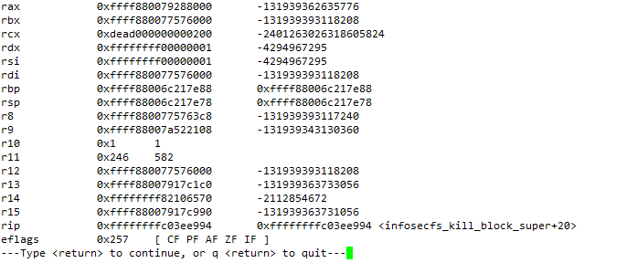
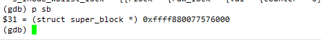
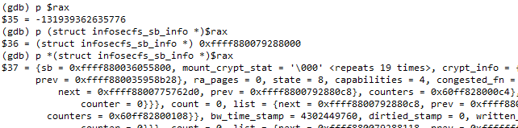

# gdb调试命令


## 断点

### 设置断点

```shell
b function_name
```

```shell
b *address
```

**注意：“*”号是必须加在地址前面的，否则会认为是行号**

```shell
b line_num
```


### 删除断点

```shell
clear 要清除的断点行号
```

```shell
delete 要清除的断点编号
```


### 禁用/启用断点

```shell
disable/enable 断点编号
```


### 禁用全部断点

```shell
disable
```


### 查看断点

```shell
info b
```


## 变量

### 查看当前stack frame局部变量

```shell
info locals
```


### 查看当前stack frame参数

```shell
info args
```


### 打印变量

```shell
p variable
```


### 设置变量值

```shell
set 变量名 = 变量值			// 改变程序中某个变量的值
```


### 变量类型

```shell
whatis 变量名				// 显示某个表达式的数据类型
```


## 寄存器

### 显示寄存器

```shell
info registers
i r
info r
```




### 访问寄存器

寄存器名前加`$`，进行访问

```shell
$rax
$rbx
...
$rip
...
```


## 打印信息

### 打印字符串

```shell
p *array@length				// length是想要查看的长度
```

### 打印结构体

如下sb为super_block结构指针，直接使用p打印会打印指针数值，并不会显示其中成员



使用`p *sb`时，这样会显示详细的成员


### 强制转换类型打印

下面的例子为打印rax寄存器内容，并强制转换成一个结构体指针打印



```shell
p (type)arg
```


## 当前EIP或RIP

当浏览代码，找不到正在调试的地方时，使用`where`命令进行查找当前调试位置：

```shell
where
```


## 流程控制

### 单步调试

```shell
next					// 单步跟踪程序，当遇到函数调用时，也不进入此函数体
n

step					// 单步调试如果有函数调用，则进入函数；
s
```


如果有时调试太快，错过了想要调试的位置，当你的代码环境支持时，你可以`jump`到那行，再执行一次。

```shell
j 行号
```


执行到当前函数返回

```shell
finish
```


强制返回当前函数

```shell
return
```


执行到指定位置

```shell
until 行号
```


## 汇编

```shell
x

display

disassemble
```

