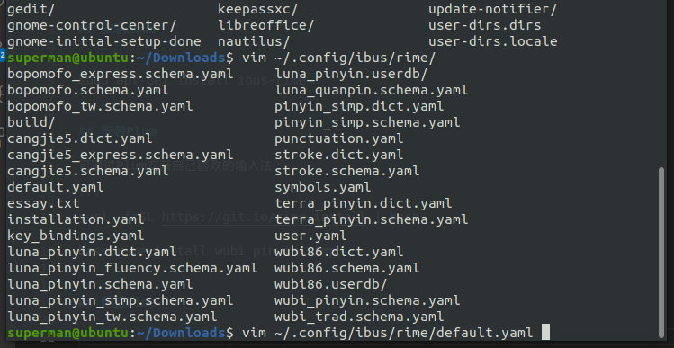
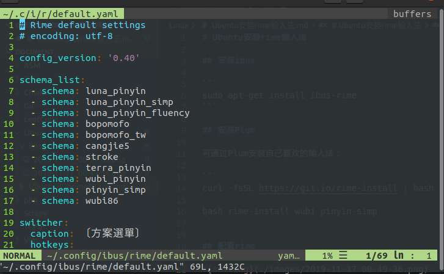
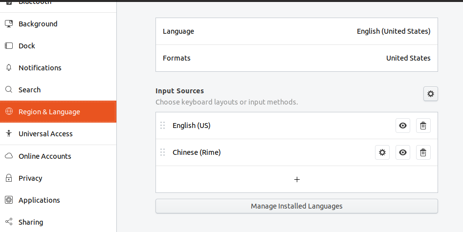

# Ubuntu安装rime输入法

## 安装ibus

```
sudo apt-get install ibus-rime
```

## 安装Plum

可通过Plum安装自己喜欢的输入法：

```
curl -fsSL https://git.io/rime-install | bash

bash rime-install wubi pinyin-simp
```

## 配置rime



在`default.yaml`中添加上输入法




## 添加输入源



重启操作系统就可以用了


## 安装emoji

### Linux 安装

使用Plum安装：

```
bash rime-install emoji
```

配置：

```
bash rime-install emoji:customize:schema=luna_pinyin
```

### Windows安装

.jpg)

.jpg)

在windows上使用官方方法不容易成功，现使用手动方式：

.jpg)

在安装emoji后，用户文件夹中会出现`emoji_suggestion.yaml`和`opencc`文件夹。

比如我要给五笔添加emoji，新建文件`wubi86.custom.yaml`

将`emoji_suggestion.yaml`中的内容全部复制到`wubi86.custom.yaml`中，重新部署即可。


