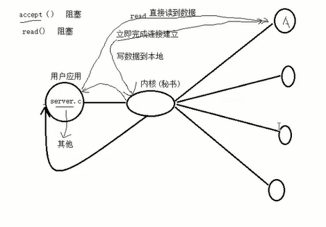
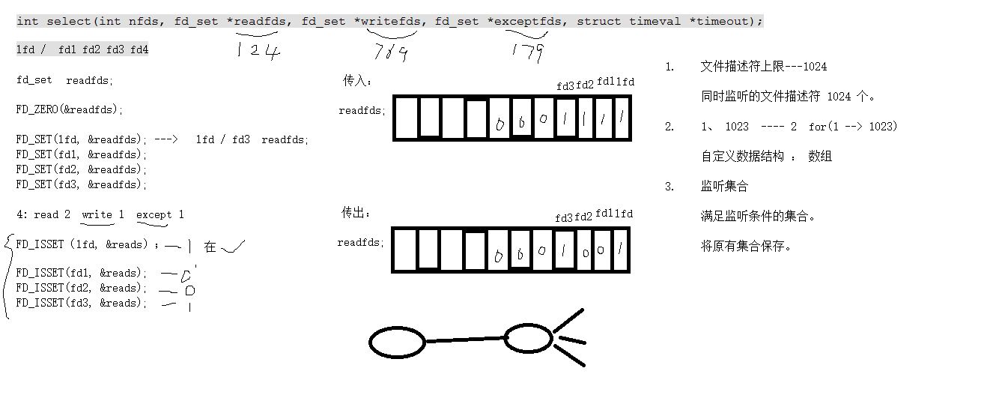

# select

多路IO转接服务器




一种用来监控文件描述符可读、可写、异常超时的函数。


```c
       /* According to POSIX.1-2001, POSIX.1-2008 */
       #include <sys/select.h>

       /* According to earlier standards */
       #include <sys/time.h>
       #include <sys/types.h>
       #include <unistd.h>

       int select(int nfds, fd_set *readfds, fd_set *writefds,
                  fd_set *exceptfds, struct timeval *timeout);
```

nfds:所监听的所有文件描述符中，最大的文件描述符+1

fd_set:分别对应所监听的文件描述符可读、可写、异常事件。

```c
       void FD_CLR(int fd, fd_set *set);		// 将fd从set中清除出去
       int  FD_ISSET(int fd, fd_set *set);		// 判断fd是否在集合中
       void FD_SET(int fd, fd_set *set);		// 将fd设置到set集合中去
       void FD_ZERO(fd_set *set);		// 将set集合清空 0
```


伪代码：

```c
fd_set readfds;
FD_ZEOR(&readfds);
FD_SET(fd1, &readfds);
FD_SET(fd2, &readfds);
FD_SET(fd3, &readfds);
select();
for
FD_ISSET(fd1, &readfds) --- 1 满足
```


返回值： 成功：所监听的所有的监听集合中，满足条件的总数

​				失败：返回-1




