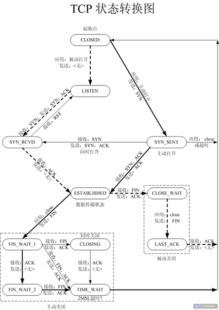

# TCP状态转换

粗实线：主动发起连接、主动关闭连接

细实线：指两端同时操作部分

虚线：被动发起连接、被动关闭连接

ESTABLISHED:连接建立

FIN_WAIT2:主动关闭一方半关闭（在我发了FIN并收到ACK时）

TIME_WAIT:主动发起关闭请求，超时目的：不确定对方是否收到我发送的ACK，如果对端没收到，对端会继续给我发FIN。**确保最后一个ACK能顺利到达对端，由主动关闭方等待**