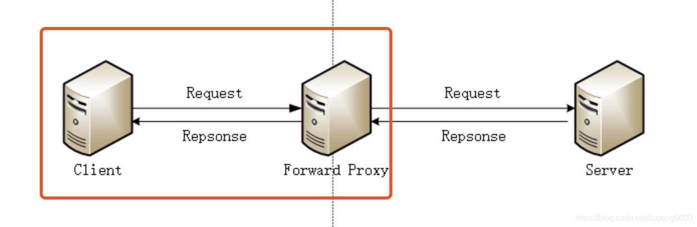
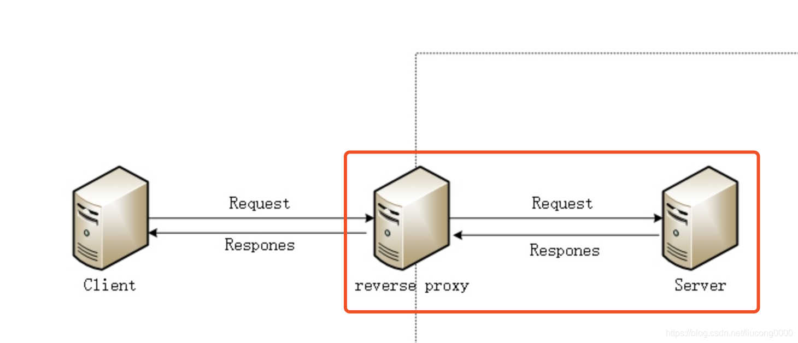

# nginx 之 正向代理及反向代理的解释

> - 正向代理
>
> 
>
> （1）服务对象不同
>
> 正向代理服务器的服务对象是客户端，可以将客户端和代理服务器看作一个整体。
>
> （2）配置方法不同
>
> 需要在客户端配置代理服务器的地址，比如在浏览器上设置代理服务器地址
>
> （3）作用
>
> 当客户端没有办法和服务器直接进行通信的时候，这个时候使用代理服务器是让客户端和服务端通信的好方法。客户端指定请求给代理服务器，代理服务器将请求发送给服务端，将服务端的内容取来，返给客户端。这样完成客户端和服务端的访问。

> - 反向代理
>
> 
>
> （1）服务对象
>
> 反向代理服务器的服务对象是服务端，可以将服务端和代理服务器看作一个整体。
>
> （2）配置方法
>
> 代理服务器上要配置上服务端的地址。比如：nginx 配置方向代理地址
>
> （3）作用
>
> 可以保证内网的安全，客户端没有办法直接和服务端进行通信，当客户端的请求直接发送给代理服务器，代理服务器去取过服务端的内容，返回给客户端。还有就是做负载均衡，这个是用的最多的，可以保证网站的高并发，高可用性

---

[终于有人把正向代理和反向代理解释的明明白白了！ - 云+社区 - 腾讯云 (tencent.com)](https://cloud.tencent.com/developer/article/1418457)

