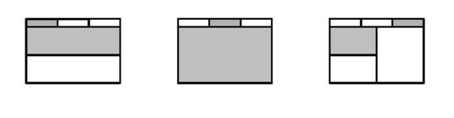

# 文件

Vim允许在一个编辑会话中编辑多个文件，既可以每次显示一个文件，也可以把工作区分成若干`分割窗口`或`标签页`，每个`窗口`或`标签页`包含一个独立的`缓冲区`。

## 用缓冲区列表管理打开的文件

### 文件与缓冲区的区别

就像其他编辑器一样，VIM允许读取、编辑文件，并保存修改。在工作过程中，我们通常会说“我们正在编辑一个文件”，但真实情况并不是这样，我们编辑的只是`文件在内存中的映像`，也就是Vim术语中的`缓冲区`。

文件是存储在磁盘上的，而缓冲区存在于内存中。当Vim打开一个文件时，该文件的内容被读入一个具有相同名字的缓冲区。

### 结识缓冲区列表

```shell
➾  $  cd  code/files 
➾  $  vim  *.txt 
《  2  files  to  edit

➾  :ls 
《  1  %a          "a.txt"                  line  1  
	2              "b.txt"                  line  0

➾  :bnext ➾  :ls 
《  1  #          "a.txt"                  line  1    
	2  %a         "b.txt"                  line  1
```

`%a`符号指明哪个缓冲区在当前窗口中可见，`#`符号则代表轮换文件。按`<C-^>`可以在当前文件和轮换文件间快速切换。

### 使用缓冲区列表

`:bprev`	指向移动
`:bnext`	正向移动
`:bfirst`	开头
`:blast`	结尾

根据`:ls`显示的编号，可以用`:buffer N`命令直接凭编号跳转到一个缓冲区。

也可以更直观的`:buffer {bufname}`格式，`{bufname}`只需包含文件路径中足以唯一标识此缓冲区的字符即可。

### 关闭缓冲区

`:bdelete N`

具体操作查看help

## 用参数列表将缓冲区分组

> 参数列表易于管理，适用于一批文件进行分组，使其更容易访问。

## 管理隐藏缓冲区

> Vim对被修改过的缓冲区会给予特殊对待，以防未加保存就意外退出。

当修改a.txt后：
```
➾ :ls 
《 1  %a + "a.txt"                  line 1   
   2       "b.txt"                  line 0
```
当现在切换缓冲区时：
```
➾ :bnext 《 E37: No write since last change (add ! to override) 
```
如果强制切换的话使用：`:bnext!`
```
➾ :bnext!  
➾ :ls
《 1 #h + "a.txt"                   line  1
   2 %a   "b.txt"                   line  1
```

在退出时，需要对隐藏缓冲区做处理。如果要保留修改，可以执行`:write`命令把缓冲区保存到文件；如果想摒弃此修改，可以执行`:edit!`，重新从磁盘读取此文件，这会用文件的内容覆盖缓冲区中的内容。当缓冲区内容与磁盘文件一致后，可以再次尝试执行`:quit`命令了。

如果想退出Vim而不想检查未保存的修改，可以执行`:qall!`命令；如果想保存所有有改动的缓冲区而无需逐个检查，可以用`:wall`命令。


---


## 工作区分割窗口

如果先执 行 `<C-w>s`，再执行 :edit {filename}，就会把工作区分成两个窗 口，并在其中一个窗口中打开新缓冲区，另一个窗口则继续显示原有的 缓冲区。另外一种做法是使用 :split {filename} 命令，它把上述两 步合并成为了一步。

|命令|用途|
|---|---|
|\<c-w\>s|水平分割当前窗口，新窗口仍显示当前缓冲区|
|\<c-w\>v|垂直分割当前窗口，新窗口仍显示当前缓冲区|
|:sp[lit] {file}|水平分割当前窗口，新窗口载入{file}|
|:vsp[lit] {file}|垂直分割当前窗口，新窗口载入{file}|

### 关闭窗口

`:close` `<C-w>c`

`:only`  `<C-w>o`

## 用标签页将窗口分组

用Vim的标签页可以把工作分隔到不同的工作区。Vim中的标签页更像是Linux中的虚拟桌面，而不是你其他文本编辑器中的标签页。

在vim中，标签页是可以容纳一系列窗口的容器（:h **tabpage**）

**当用edit命令打开一个文件时，Vim却不会自动创建一个新标签页，而是创建一个新缓冲区，并把该缓冲区显示到当前窗口。Vim是用缓冲区列表对打开的文件进行管理的。**

vim的标签页与缓冲区并非一一对应的关系，相反，应该把标签页想成容纳一系列窗口的窗口。下图**每个标签页都包含一个或多个窗口**。



**把标签页想象成容纳一系列窗口的容器。**

### 打开及关闭标签页

|命令|用途|
|---|---|
|:tabe[eit] {filename}|在新标签页中打开{filename}|
|\<c-w\>T|把当前窗口移到一个新标签页|
|:tabc[lose]|关闭当前标签页及其中的所有窗口|
|:tabo[nly]|只保留活动标签页，关闭所有其他标签页|

### 在标签页中切换

|Ex命令|普通模式命令|用途|
|---|---|---|
|:tabn[ext] {N}|{N}gt|切换到编号为{N}的标签页|
|:tabn[ext]|gt|切换到下一标签页|
|:tabp[revious]|gT|切换到上一标签页|


## 缓冲区

不带任何参数打开多个文件便可以把它们都放入缓冲区：

```shell
vim a.txt b.txt
```

当使用`:q`关闭文件时，是否看到过`1 more file to edit`的警告？那就是缓冲区的文件。

缓冲区之间跳转最常用的方式便是`ctrl+^`(不需要按下shift)来切换当前缓冲区和上一个缓冲区。

|||
|--|--|--|
|:ls, :buffers|列出所有缓冲区|
|:bn[ext]|下一个缓冲区|
|:bp[revious]|上一个缓冲区|
|:b {number, expression}|跳转到指定缓冲区|
|:bd, :bd!|删除缓冲区，强制删除|


`:b`接受缓冲区编号，或者部分文件名。例如：

- `:b2`将会跳转到编号为2的缓冲区，如果你正在用`:ls`列出缓冲区，这时只需要输入编号回车即可。
- `:b exa`将会跳转到最匹配`exa`的文件名，比如`example.html`，模糊匹配撕开文件正是vim缓冲区的强大之处。
