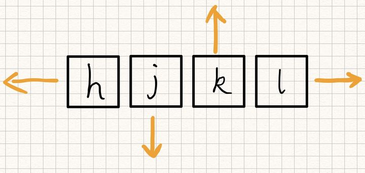
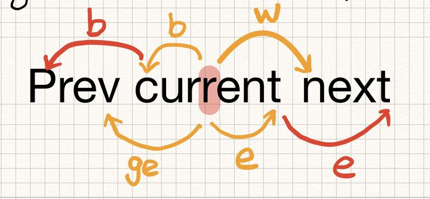

# 光标移动

## 上下左右

| H    | J    | K    | L    |
| ---- | ---- | ---- | ---- |
| 左   | 下   | 上   | 右   |

## 基于单词的移动

| w(word)        | b(back)        | e(end)         | ge             |
| -------------- | -------------- | -------------- | -------------- |
| 下一个单词开头 | 上一个单词开头 | 下一个单词结尾 | 上一个单词结尾 |

## 基于行移动

### 行间跳转

| gg           | G            | :22\<enter> |
| ------------ | ------------ | ----------- |
| 跳到全文首行 | 跳到全文末尾 | 跳转到22行  |

### 开头和结尾

| 0          | $          |
| ---------- | ---------- |
| 移动到行首 | 移动到行尾 |

### 行内定位

| f\<char>                                | t\<char>                                          |
| --------------------------------------- | ------------------------------------------------- |
| 移动到当前行的第一个char字母处，f即find | 移动到当前行的第一个char字母的前一个字母上，t即to |

> F\<char>和T\<char>即上面的反向查找

| 分号`;`                                      | 逗号`,`                                      |
| -------------------------------------------- | -------------------------------------------- |
| 移动到下一处该字符出现的位置，相当于重复f和t | 移动到上一处该字符出现的位置，相当于重复F和T |

### 基于查找

| /word\<Enter>                                                | ?word\<Enter> |
| ------------------------------------------------------------ | ------------- |
| 从光标向后查找word单词，将光标移动到第一个word单词的首字母w处 | 向前查找      |

### 匹配括号间跳转

`%` 从当前选中的括号处，跳到对应的另一个括号位置

**``** 在最近的两次跳转中来回跳

### 跳转

vim会记录跳转前后的位置，并提供命令让我们原路返回

- ctrl + o 跳转到上次跳转的位置
- ctrl + i 和\<c+o>相反