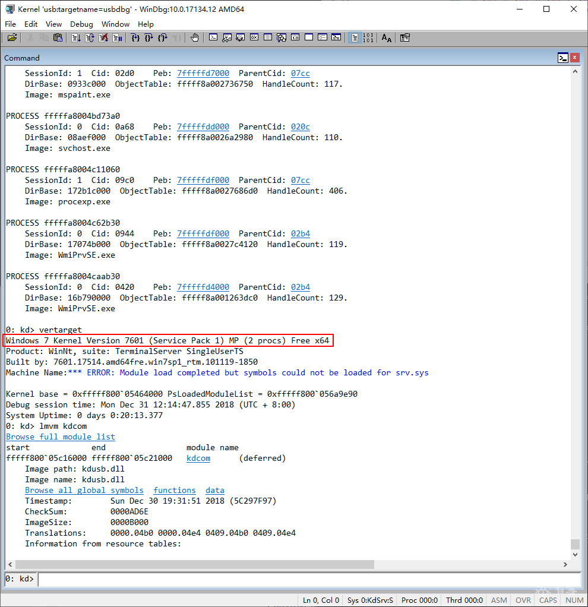

USB3调试线就是普通的连接线，十几块钱，剥开剪断里面的红色、白色、绿色的线，或者扣掉接头的1、2、3号金属片。

1.用usbview找到支持调试的xHCI对应的Bus, Device, and Function numbers，然后用十六进制编辑工具修改kdusb.dll文件偏移0x2850处的三个字节。我的测试电脑上xHCI的b.d.f是0.20.0，所以这里三个字节是0、0x14、0。

2.**替换系统自带的kdusb.dll文件**

3.修改被调试系统的BCD文件，开启内核调试
```
bcdedit /dbgsettings usb targetname:usbdbg

bcdedit /set debug on
```

4.主机上运行windbg
```
windbg.exe -d -k usb:targetname=usbdbg
```

5.启动被调试电脑，按F8选择“禁用驱动程序强制签名”




[原文链接](https://bbs.pediy.com/thread-248836.htm)
