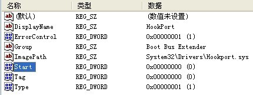
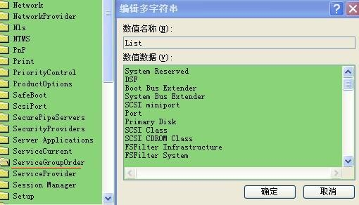
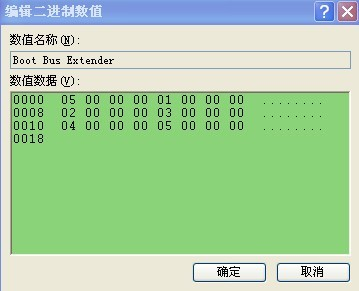

## 启动顺序

一般情况下有以下几种：

- SERVICE_BOOT_START (0)

> SERVICE_BOOT_START (0x00000000) Indicates a driver started by the operating system (OS) loader

- SERVICE_SYSTEM_START (1)

> SERVICE_SYSTEM_START (0x00000001) Indicates a driver started during OS initialization.

- SERVICE_AUTO_START (2)

> SERVICE_AUTO_START (0x00000002) Indicates a driver started by the Service Control Manager during system startup.

- SERVICE_DEMAND_START (3)

> SERVICE_DEMAND_START (0x00000003) Indicates a driver started on demand

- SERVICE_DISABLED (4)

> SERVICE_DISABLED (0x00000004) Indicates a driver that is not started by the OS loader, Service Control Manager, or PnP Manager

除了以上的 start type可以控制启动顺序，还可以通过别的注册表项进行更加细致的微调

在路径：`计算机\HKEY_LOCAL_MACHINE\SYSTEM\CurrentControlSet\Services\Hookport`下，其start设置为0启动，还有一个Group项，用来排序所有0启动类型驱动的启动顺序。

路径：`计算机\HKEY_LOCAL_MACHINE\SYSTEM\CurrentControlSet\Control\ServiceGroupOrder`下有一个List用来排序同一启动类型的启动顺序

当上述两项也相同时，路径：`计算机\HKEY_LOCAL_MACHINE\SYSTEM\CurrentControlSet\Control\GroupOrderList`,根据图1中的`Tag`项对同一`Group`排序

.jpg)

