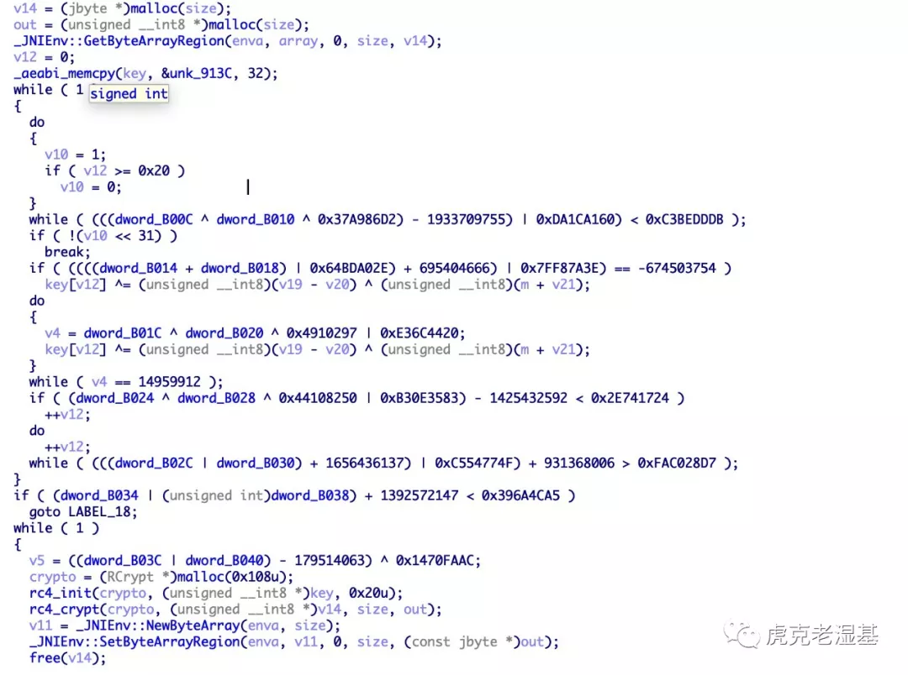
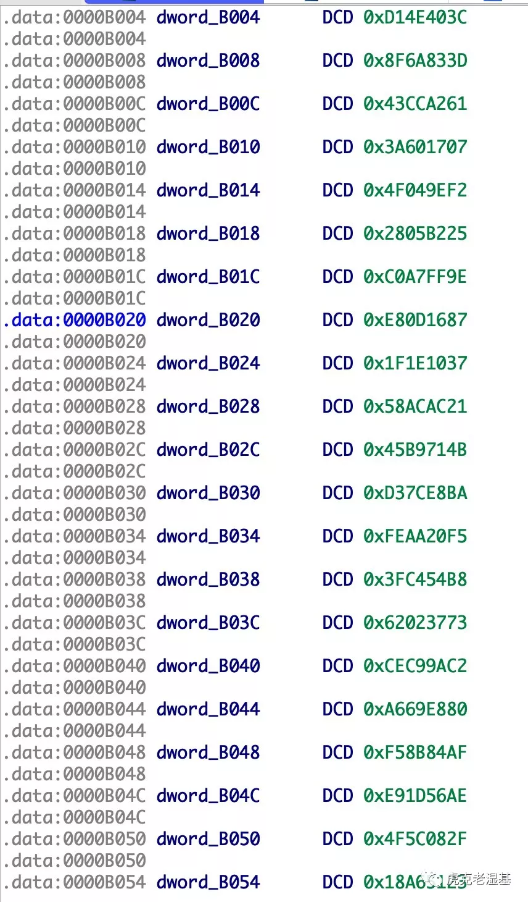
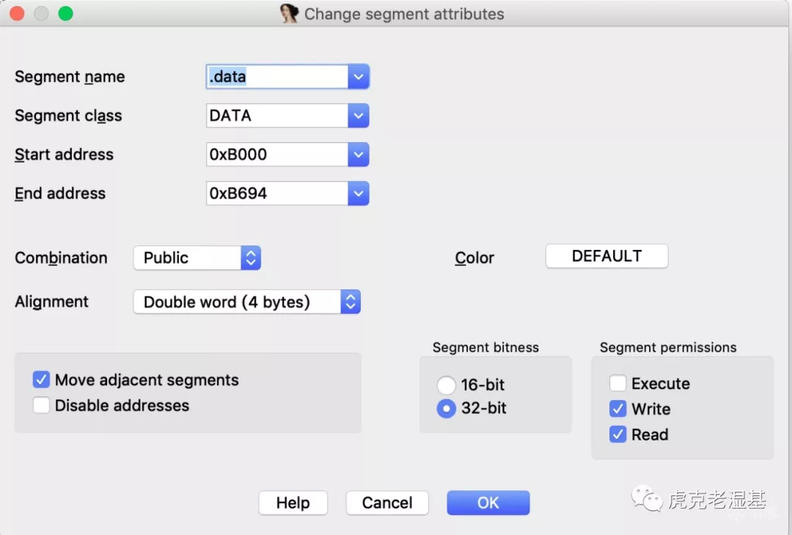
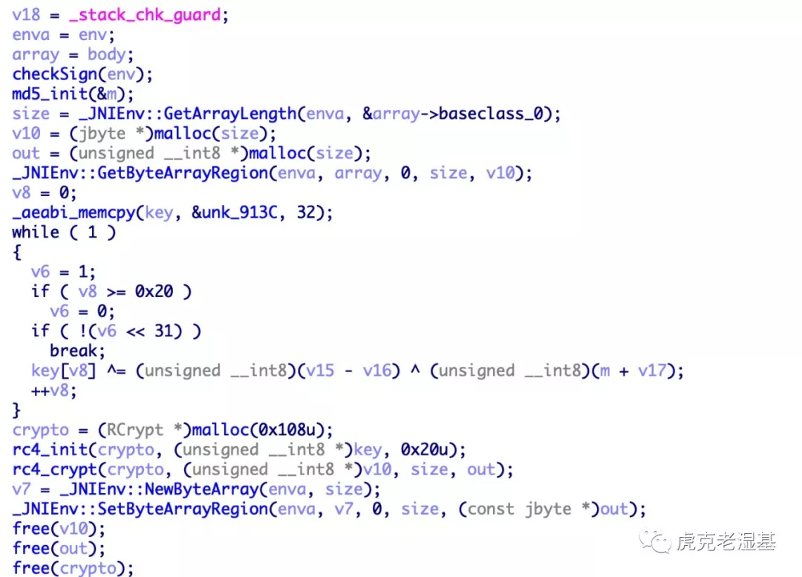

原文链接：https://bbs.pediy.com/thread-257213-1.htm

# 什么是 Bogus Control Flow

`Bogus Control Flow` 即虚假控制流，顾名思义，就是假的控制流，一般(OLLVM)表现为 `一条结果恒定的条件表达式` & `一个永不到达的分支`。

# OLLVM 中的 BCF

OLLVM 中的虚假控制流是利用`全局变量`来构造条件表达式以制造虚假控制流，因为这个全局变量不会有写入的地方，所以这个表达式即`一条结果恒定的条件表达式`，因此始终只会走向一个真实分支，而另外的虚假分支即`一个永不到达的分支`。 大家把这个表达式称为 `"不透明谓词"`

# 反混淆的思路

上面说了, 虚假控制流就是`永不到达的分支`, 只要你了解一点点的编译原理、编译器优化，就会想到，这种代码应该都是被`死代码消除(DCE, Dead Code Elimination)`的。
所以只要能实现运行一遍 DCE 即可消除掉 BCF 混淆。

# 利用 IDA 反混淆

HexRays Decomplier肯定是有DCE优化的，但是为什么不能自动优化掉BCF? 原因出在`不透明谓词`的识别上。

 

之前快出 IDA7.3 的时候，就有人说 7.3 支持自动优化不透明谓词，然而拿到手之后发现并没有什么区别, 实际上经过测试，这个优化我用 6.9 测试也是存在的。

 

然而，使 IDA 无法识别出不透明谓词的原因是：`恒定的全局变量`是变量而不是常量，也就是说，这个变量的地址是可写而非只读的，你想办法把它改为只读，IDA 就可以进行优化了。

## 实测

随便找了一个 bcf 样本测试。优化之前是这个样子的：

 

 

那么如何让这堆 `dword_xxx` 变成可读呢？

 

 

 

因为我的`.data` 段里没有任何其他东西，所以:

 

 

 

`Edit Segment`， 把 `Write` 勾掉即可。

 

再按一下 F5，神奇的事情就发生了～

 

 